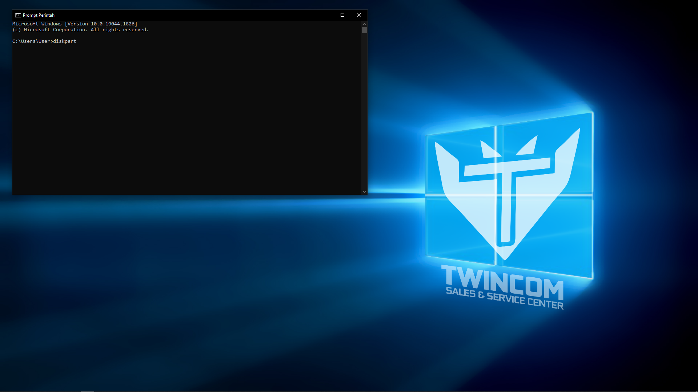

# **Partition**

Partisi, atau partisi disk, adalah divisi logis pada hard disk drive (HDD)/Solid State Drive (SSD) yang memungkinkan PC memiliki drive yang berbeda. Partisi membagi hard HDD/SSD menjadi beberapa unit penyimpanan logis pada satu drive tetapi berfungsi sebagai banyak drive. Program perangkat lunak yang disebut editor partisi dapat digunakan untuk membangun, menghapus, mengubah ukuran, dan mengontrol partisi pada HDD. Partisi juga dapat disebut sebagai irisan.

Partisi hardisk saat ini tersedia dalam dua macam. terdiri dari MBR (Master Boot Record) dan GPT (GUID Partition Table).

## **MBR**

MBR atau Master Boot Record merupakan arsitektur partisi hardisk yang memegang informasi mengenai file system, logical partition, dan mengatur sistem. Fungsi dari MBR sangat penting dalam proses booting. Pada saat booting sedang berjalan, MBR membantu dalam pencarian partisi yang sedang aktif untuk menyimpan informasi booting. Setelah itu, dilakukan pencarian sector utama dari partisi yang aktif untuk bisa mendapatkan boot dari sector tersebut. Sehingga, boot sector dari partisi bisa disimpan ke dalam memori dan memberikan kontrol penuh terhadap kode yang dijalankan di dalam boot sector.

## **GPT**

 GUID Partition Table(GPT) merupakan tabel partisi berstandart untuk bagian layout dari partisi hardisk menggunakan Globally Unique Identifier. Partisi hardisk kali ini lebih unggul jika dibandingkan dengan MBR. Hardisk GPT dapat menyimpan dalam jumlah yang besar dari MBR, yaitu hingga 9,4 ZB dan didukung partisi primary sebanyak 128. GPT hadir untuk mengembangkan sistem pengelolaan dan menyempurnakan dari MBR. 

### Perbedaan

1. Memori atau kapasitas penyimpanan pada MBR lebih sedikit dibandingkan GPT. MBR hanya mampu menyimpan sebanyak 2 TB, sedangkan GPT sebanyak 9,4 ZB.

2. Support partisi pada MBR hanya sebanyak 4 partisi primary saja. Sedangkan pada GPT, memiliki sebanyak 128 partisi primary.

3. Sistem operasi yang dapat menggunakan GPT hanya windows yang kompatibel saja, seperti windows XP 64 bit. Sedangkan, MBR bisa digunakan pada semua sistem operasi.

4. Tempat penyimpanan informasi mengenai sistem operasi dan partisi pada MBR hanya bisa dilakukan oleh sector utama atau sektor pertama. Sedangkan pada GPT, informasi yang sudah disimpan bisa dibackup lebih dari satu kali.

5. Saat partisi primary digunakan sebanyak lebih dari 1 partisi, GPT bisa mengoptimalkan semua partisi primary untuk bisa bekerja sama. Sedangkan, MBR harus mengorbankan satu partisi sebagai extended.

## **Cara mengetahui Partisi MBR/GPT**

1. pertama-tama tekan tombol `Windows + S` untuk masuk pada menu pencarian

2. pada menu pencarian ketikkan `cmd` untuk mencari **Command Prompt**

3. kemudian anda akan dialihkan pada command prompt CLI(Command Line Interface)

4. setelah menjalankan command prompt maka ketikkan sebuah perintah berupa `diskpart`, dan anda akan dipindahkan lagi ke CMD untuk melihat disk and.

5. jika sudah, selanjutnya berikan perintah list disk.

6. maka pada tabel kita bisa melihat apakah laptop menggunakan partisi MBR atau GPT.

