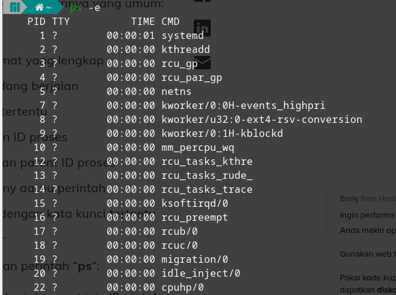

# Sistem Operasi

## **Komponen Sistem Operasi**

### **Manajemen Proses**

contoh manajemen Proses :


untuk melihat manajemen proses pada linux kita bisa mengetikkan pada terminal berupa `top`



kita juga bisa menampilkan semua sistem operasi yang ada dengan mengetikkan `ps -e` 


kita juga bisa melihat operasi yang sedang berjalan dengan mengetikkan `ps -ef`


### **Manajemen Memori Utama**

contoh manajemen memori utama :


Untuk melihat swap space dan banyaknya swapping yang terjadi pada komputer kita bisa mengetikkan pada terminal dengan `free`


Untuk melihat penggunaan memori dan swap pada komputer, gunakan perintah `cat /proc/meminfo` pada Terminal.


Untuk mengoptimalkan penggunaan memori fisik (RAM) dengan memori virtual (Swap), kita dapat mengaturnya dengan langkah sebagai berikut. Mula-mula, lihat terlebih dahulu derajat kecenderungan atau agresifitas kernel untuk memindahkan proses dari memori ke swap dengan memberikan perintah swappiness pada Terminal.


Nilai swappiness sendiri merepresentasikan kecenderungan pemindahan proses dari memori ke swap, dengan range 0-100. Semakin rendah nilai swappiness, maka kernel akan menghindari proses swapping selama mungkin; sebaliknya, jika nilai swappiness semakin tinggi, maka kernel akan melakukan proses swapping sesering mungkin.

Untuk mengubah nilai swappiness secara sementara (dalam artian hanya berlangsung selama komputer aktif dan tidak di-reboot), berikan perintah sudo sysctl vm.swappiness=nilai_yang_diberikan.

### **Manajemen Sistem Berkas**


gunakan perintah `ls` untuk menampilkan berkasi atau file apa saja yang ada.


perintah `cd namaberkas` untuk masuk kedalam berkas, jika untuk keluar satu folder gunakan perintah `cd ..`, jika untuk langsung keluar hingga home gunakan perintah `cd`.


perintah `mkdir namaberkas` untuk membuat folder baru.


gunakan perintah `rmdir namaberkas` untuk menghapus folder


gunakan perintah `touch namaFile` untuk membuat file baru


gunakan perintah `rm namaFile` untuk menghapus file tersebut.

## **Layanan Sistem Operasi**

### **Pembuatan Program**

#### **Pembuatan Program**


pembuatan program bisa kita lakukan langsung pada terminal linux dengan menggunakan perintah `touch namaFile.ekstensi` atau bisa juga langsung dieditor yang digunakan.

#### **eksekusi Program**


kita juga bisa mengeksekusi program di terminal, misal disini saya mengeksekusi program dengan bahasa java jadi saya harus melakukan compiler terlebih dahulu dengan perintah `javac Main.java` jika tidak ada error maka langsung kita eksekusi dengan perintah `java Main`.

#### **Deteksi Error**


bisa dilihat pada gambar di atas kalau program error, jadi ini merupakan layanan sistem operasi berupa bisa mendeteksi Error

```java
            Main.java:3: error: cannot find symbol
                    System.ou.println("Hello World");
                        ^
            symbol:   variable ou
            location: class System
            1 error
```

## **System call**

### **Manajemen/Manipulasi berkas**


dilinux kita bisa memanipulasi file dengan perintah `nano nama.file` sebelum menggunakan perintah nano sebelumnya install dahulu pkg nano.

### **Modifikasi berkasi**


dinano kita bisa memodifikasi suatu berkas jika ingin keluar bisa tekan `ctrl + x` nanti akan diberi pilihan untuk menyimpan modifikasi atau tidak.

### **Loading dan eksekusi program**


kita bisa mengeksekusi suatu program misalnya program java kita bisa mengkompiler dan menjalankan programnya, tapi sebelum bisa melakukan itu kita harus memasang packages javanya terlebih dahulu.