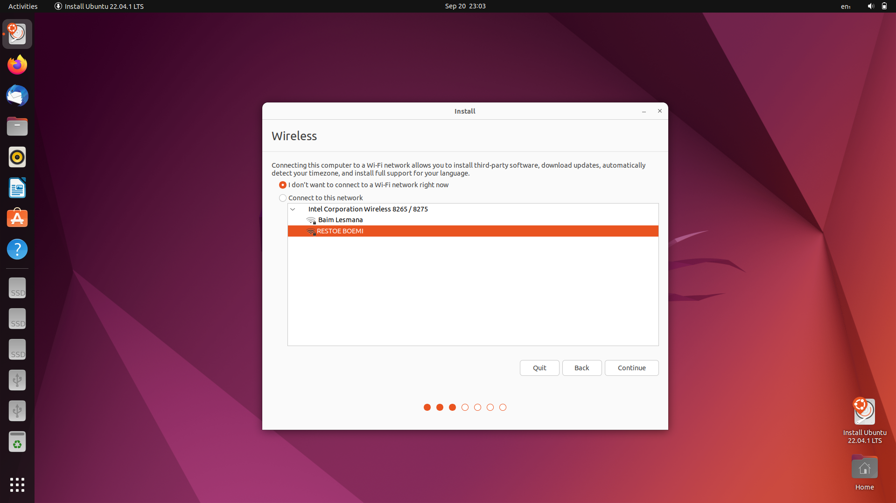
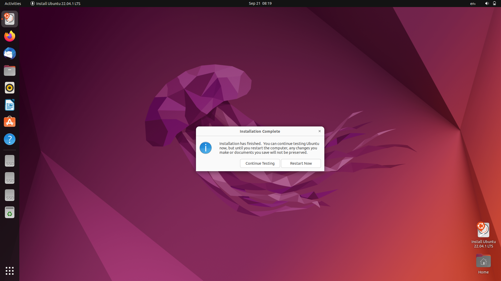

# **INSTALANSI LINUX UBUNTU**

## **Bahan :**

- 2 buah flashdisk (8 dan 4 / 8 dan 16 GB)
- file ISO linux (debian, ubuntu, dll)
- software bootable

## **Booting di flashdisk**

disini saya menggunakan rufus untuk melakukan booting, untuk mendownload rufus bisa klik **[disini](https://rufus.ie/en/)**

selanjutnya jalankan rufus dan akan muncul tampilan seperti gambar di atas

kemudian masukkan flashdisk yang ingin dijadikan bootable

kemudian pada bagian perangkat pilih flashdisk yang maun anda jadikan boot, kemudian pilih linux yang mau digunakan, saya disini menggunakan linux ubuntu, jika sudah, pilih skema partisi, saya memakai MBR, selanjutnya mulai progres booting

maka tampil seperti gambar di atas, maka pilih **Tulis dalam mode ISO Image**

selanjutnya akan muncul peringatan bahwa data yang ada di dalam flashdisk akan dihapus, maka tekan ok

dan tunggu sampai progress selesai.

jika sudah selesai booting, klik tutup.

## INSTALANSI LINUX DI FLASHDISK

mulai ulang pc/laptop anda

    Saat melakukan restart atau mulai ulang, saat layar menyala maka tekan f2 maka akan dipindahkan ke menu bios dan pilih lah kemenu boot, buatlah flashdisk berada paling atas dengan memindahkannya

    kemudian simpan dan keluar (flashdisk yang dijadikan booting harus sudah dicolokkan).

    

Jikan sudah selesai maka selanjutnya akan berpindah kesini, kemudian klik instaal ubuntu, pilih bahasa

pilih keyboard layaout saya menggunakan defaulu

selanjutnya pilih saja `i don't want to connect to a WI FI network`.

pilih minimal instalansi atau normal instalansi

dan pilih something else untuk melakukan partisi secara manual

pilih terlebih dahulu flashdisk yang mau kita partisi

tekan continue jika sudah yakin dengan pilihan anda bahwa itu adalah flashdisk yang mau anda gunakan, karena isi dari flashdisknya akan dihapus

selanjutnya cari flashdisk yang sudah dikosongkan tadi dan lakukan partisi

pilih freespace dan tekan tombol tambah untuk membuat partisi

lakukan seperti gambar di atas

kemudian kita membuat praktisi untuk root

jika sudah selesai maka install, sebelum menginstall harap cek ulang partisi anda

tekan continue

pilih waktu setempat

atur user dan password, password sama user jangan sampai lupa, selanjutnya klik continue

dan tunggu

lakukan restart atau hidupkan ulang.

saat proses restart jangan lupa untuk melepaskan flashdisk boot sebelumnya.