# Modern Operating System

## 1 Introduction

_1 Pengantar_

A modern computer consists of one or more processors, some main memory,
disks, printers, a keyboard, a mouse, a display, network interfaces, and various
other input/output devices. All in all, a complex system.oo If every application programmer had to understand how all these things work in detail, no code would ever
get written. Furthermore, managing all these components and using them optimally
is an exceedingly challenging job. For this reason, computers are equipped with a
layer of software called the __operating system__, whose job is to provide user programs with a better, simpler, cleaner, model of the computer and to handle managing all the resources just mentioned. Operating systems are the subject of this
book.

_Komputer modern terdiri dari satu atau lebih prosesor, beberapa memori utama, disk, printer, keyboard, mouse, layar, antarmuka jaringan, dan berbagai perangkat input/output lainnya. Secara keseluruhan, sistem yang kompleks. oo Jika setiap pemrogram aplikasi harus memahami bagaimana semua hal ini bekerja secara detail, tidak akan ada kode yang bisa ditulis. Lebih jauh lagi, mengelola semua komponen ini dan menggunakannya secara optimal adalah pekerjaan yang sangat menantang. Untuk alasan ini, komputer dilengkapi dengan lapisan perangkat lunak yang disebut **sistem operasi**, yang tugasnya menyediakan program pengguna dengan model komputer yang lebih baik, lebih sederhana, lebih bersih, dan untuk menangani pengelolaan semua sumber daya yang baru saja disebutkan. Sistem operasi adalah pokok bahasan buku ini._

Most readers will have had some experience with an operating system such as
Windows, Linux, FreeBSD, or OS X, but appearances can be deceiving. The program that users interact with, usually called the __shell__ when it is text based and the
__GUI (Graphical User Interface)__—which is pronounced ‘‘gooey’’—when it uses
icons, is actually not part of the operating system, although it uses the operating
system to get its work done.

_Sebagian besar pembaca akan memiliki pengalaman dengan sistem operasi seperti Windows, Linux, FreeBSD, atau OS X, tetapi tampilan dapat menipu. Program yang berinteraksi dengan pengguna, biasanya disebut **shell** ketika berbasis teks dan **GUI (Graphical User Interface)** yang diucapkan '' lengket '' ketika menggunakan ikon, sebenarnya bukan bagian dari sistem operasi, meskipun menggunakan sistem operasi untuk menyelesaikan pekerjaannya._

A simple overview of the main components under discussion here is given in
Fig. 1-1. Here we see the hardware at the bottom. The hardware consists of chips,
boards, disks, a keyboard, a monitor, and similar physical objects. On top of the
hardware is the software. Most computers have two modes of operation: kernel
mode and user mode. The operating system, the most fundamental piece of software, runs in __kernel mode__ (also called __supervisor mode__). In this mode it has complete access to all the hardware and can execute any instruction the machine is
capable of executing. The rest of the software runs in __user mode__, in which only a
subset of the machine instructions is available. In particular, those instructions that
affect control of the machine or do __I/O )Input__/Output" are forbidden to user-mode
programs. We will come back to the difference between kernel mode and user
mode repeatedly throughout this book. It plays a crucial role in how operating systems work.

_Gambaran sederhana dari komponen utama yang dibahas di sini diberikan pada Gambar 1-1. Di sini kita melihat perangkat keras di bagian bawah. Perangkat keras terdiri dari chip, papan, disk, keyboard, monitor, dan benda fisik serupa. Di atas perangkat keras adalah perangkat lunak. Sebagian besar komputer memiliki dua mode operasi: mode kernel dan mode pengguna. Sistem operasi, bagian paling mendasar dari perangkat lunak, berjalan dalam **mode kernel** (juga disebut **mode supervisor**). Dalam mode ini ia memiliki akses penuh ke semua perangkat keras dan dapat menjalankan instruksi apa pun yang dapat dijalankan oleh mesin. Sisa perangkat lunak berjalan dalam **mode pengguna**, di mana hanya sebagian dari instruksi mesin yang tersedia. Secara khusus, instruksi yang
mempengaruhi kontrol mesin atau melakukan **I/O )Input**/Output" dilarang untuk program mode pengguna. Kami akan kembali ke perbedaan antara mode kernel dan mode pengguna berulang kali di seluruh buku ini. Ini memainkan peran penting dalam bagaimana sistem operasi kerja._

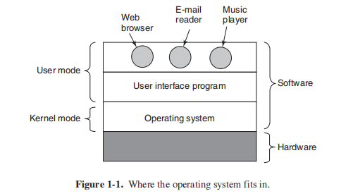

The user interface program, shell or GUI, is the lowest level of user-mode software, and allows the user to start other programs, such as a Web browser, email
reader, or music player. These programs, too, make heavy use of the operating system.

_Program antarmuka pengguna, shell atau GUI, adalah perangkat lunak mode pengguna tingkat terendah, dan memungkinkan pengguna untuk memulai program lain, seperti browser Web, pembaca email, atau pemutar musik. Program-program ini juga banyak menggunakan sistem operasi._

The placement of the operating system is shown in Fig. 1-1. It runs on the
bare hardware and provides the base for all the other software.

_Penempatan sistem operasi ditunjukkan pada Gambar. 1-1. Ini berjalan pada perangkat keras kosong dan menyediakan dasar untuk semua perangkat lunak lainnya._

An important distinction between the operating system and normal (usermode) software is that if a user does not like a particular email reader, he† is free to
get a different one or write his own if he so chooses; he is not free to write his own
clock interrupt handler, which is part of the operating system and is protected by
hardware against attempts by users to modify it.

_Perbedaan penting antara sistem operasi dan perangkat lunak normal (mode pengguna) adalah bahwa jika pengguna tidak menyukai pembaca email tertentu, dia bebas untuk mendapatkan yang lain atau menulis sendiri jika dia mau; dia tidak bebas untuk menulis sendiri pengendali interupsi jamnya, yang merupakan bagian dari sistem operasi dan dilindungi oleh perangkat keras dari upaya pengguna untuk memodifikasinya._

This distinction, however, is sometimes blurred in embedded systems (which
may not have kernel mode) or interpreted systems (such as Java-based systems that
use interpretation, not hardware, to separate the components).

_Perbedaan ini, bagaimanapun, kadang-kadang kabur dalam sistem tertanam (yang mungkin tidak memiliki mode kernel) atau sistem yang ditafsirkan (seperti sistem berbasis Java yang menggunakan interpretasi, bukan perangkat keras, untuk memisahkan komponen)._

Also, in many systems there are programs that run in user mode but help the
operating system or perform privileged functions. For example, there is often a
program that allows users to change their passwords. It is not part of the operating
system and does not run in kernel mode, but it clearly carries out a sensitive function and has to be protected in a special way. In some systems, this idea is carried
to an extreme, and pieces of what is traditionally considered to be the operating system (such as the file system) run in user space. In such systems, it is difficult to
draw a clear boundary. Everything running in kernel mode is clearly part of the
operating system, but some programs running outside it are arguably also part of it,
or at least closely associated with it.

_Juga, di banyak sistem ada program yang berjalan dalam mode pengguna tetapi membantu sistem operasi atau melakukan fungsi istimewa. Misalnya, sering ada program yang memungkinkan pengguna untuk mengubah kata sandi mereka. Ini bukan bagian dari sistem operasi dan tidak berjalan dalam mode kernel, tetapi jelas menjalankan fungsi sensitif dan harus dilindungi dengan cara khusus. Dalam beberapa sistem, ide ini dibawa ke ekstrem, dan bagian dari apa yang secara tradisional dianggap sebagai sistem operasi (seperti sistem file) berjalan di ruang pengguna. Dalam sistem seperti itu, sulit untuk menarik batas yang jelas. Segala sesuatu yang berjalan dalam mode kernel jelas merupakan bagian dari sistem operasi, tetapi beberapa program yang berjalan di luarnya bisa dibilang juga merupakan bagian darinya, atau setidaknya terkait erat dengannya._

Operating systems differ from user (i.e., application) programs in ways other than where they reside. In particular, they are huge, complex, and long-lived. The source code of the heart of an operating system like Linux or Windows is on the order of five million lines of code or more. To conceive of what this means, think of printing out five million lines in book form, with 50 lines per page and 1000 pages per volume (larger than this book). It would take 100 volumes to list an operating system of this size—essentially an entire bookcase. Can you imagine getting a job maintaining an operating system and on the first day having your boss bring you to a bookcase with the code and say: ‘‘Go learn that.’’ And this is only for the part that runs in the kernel. When essential shared libraries are included, Windows is well over 70 million lines of code or 10 to 20 bookcases. And this excludes basic application software (things like Windows Explorer, Windows Media Player, and so on).

_Sistem operasi berbeda dari program pengguna (yaitu, aplikasi) dengan cara selain di mana mereka berada. Secara khusus, mereka besar, kompleks, dan berumur panjang. Kode sumber jantung sistem operasi seperti Linux atau Windows berada di urutan lima juta baris kode atau lebih. Untuk memahami apa artinya ini, pikirkan untuk mencetak lima juta baris dalam bentuk buku, dengan 50 baris per halaman dan 1000 halaman per volume (lebih besar dari buku ini). Dibutuhkan 100 volume untuk membuat daftar sistem operasi sebesar ini—pada dasarnya seluruh rak buku. Dapatkah Anda bayangkan mendapatkan pekerjaan memelihara sistem operasi dan pada hari pertama meminta bos Anda membawa Anda ke rak buku dengan kode dan berkata: ''Belajarlah itu.'' Dan ini hanya untuk bagian yang berjalan di kernel. Ketika perpustakaan bersama yang penting disertakan, Windows memiliki lebih dari 70 juta baris kode atau 10 hingga 20 rak buku. Dan ini tidak termasuk perangkat lunak aplikasi dasar (hal-hal seperti Windows Explorer, Windows Media Player, dan sebagainya)._

It should be clear now why operating systems live a long time—they are very hard to write, and having written one, the owner is loath to throw it out and start again. Instead, such systems evolve over long periods of time. Windows 95/98/Me was basically one operating system and Windows NT/2000/XP/Vista/Windows 7 is a different one. They look similar to the users because Microsoft made very sure that the user interface of Windows 2000/XP/Vista/Windows 7 was quite similar to that of the system it was replacing, mostly Windows 98. Nevertheless, there were very good reasons why Microsoft got rid of Windows 98. We will come to these when we study Windows in detail in Chap. 11.

_Seharusnya jelas sekarang mengapa sistem operasi hidup lama—mereka sangat sulit untuk ditulis, dan setelah menulisnya, pemiliknya enggan membuangnya dan memulai lagi. Sebaliknya, sistem seperti itu berkembang dalam jangka waktu yang lama. Windows 95/98/Me pada dasarnya adalah satu sistem operasi dan Windows NT/2000/XP/Vista/Windows 7 berbeda. Mereka terlihat mirip dengan pengguna karena Microsoft memastikan bahwa antarmuka pengguna Windows 2000/XP/Vista/Windows 7 cukup mirip dengan sistem yang digantikannya, kebanyakan Windows 98. Namun demikian, ada alasan yang sangat bagus mengapa Microsoft menyingkirkan Windows 98. Kita akan sampai pada ini ketika kita mempelajari Windows secara rinci di Bab. 11._

Besides Windows, the other main example we will use throughout this book is UNIX and its variants and clones. It, too, has evolved over the years, with versions like System V, Solaris, and FreeBSD being derived from the original system, whereas Linux is a fresh code base, although very closely modeled on UNIX and highly compatible with it. We will use examples from UNIX throughout this book and look at Linux in detail in Chap. 10.

_Selain Windows, contoh utama lain yang akan kita gunakan di seluruh buku ini adalah UNIX dan variannya serta klonnya. Itu juga telah berkembang selama bertahun-tahun, dengan versi seperti System V, Solaris, dan FreeBSD yang diturunkan dari sistem aslinya, sedangkan Linux adalah basis kode baru, meskipun sangat mirip dengan model UNIX dan sangat kompatibel dengannya. Kami akan menggunakan contoh dari UNIX di seluruh buku ini dan melihat Linux secara rinci di Bab. 10._

In this chapter we will briefly touch on a number of key aspects of operating systems, including what they are, their history, what kinds are around, some of the basic concepts, and their structure. We will come back to many of these important topics in later chapters in more detail.

_Dalam bab ini kita akan secara singkat menyentuh sejumlah aspek kunci dari sistem operasi, termasuk apa itu sistem operasi, sejarahnya, jenis apa yang ada di sekitarnya, beberapa konsep dasar, dan strukturnya. Kami akan kembali ke banyak topik penting ini di bab-bab selanjutnya secara lebih rinci._

### 1.1 WHAT IS AN OPERATING SYSTEM?

_1.1 APA ITU SISTEM OPERASI?_

It is hard to pin down what an operating system is other than saying it is the software that runs in kernel mode—and even that is not always true. Part of the problem is that operating systems perform two essentially unrelated functions: providing application programmers (and application programs, naturally) a clean abstract set of resources instead of the messy hardware ones and managing these
hardware resources. Depending on who is doing the talking, you might hear mostly about one function or the other. Let us now look at both.

_Sulit untuk menjelaskan apa itu sistem operasi selain mengatakan itu adalah perangkat lunak yang berjalan dalam mode kernel — dan bahkan itu tidak selalu benar. Sebagian dari masalahnya adalah bahwa sistem operasi melakukan dua fungsi yang pada dasarnya tidak terkait: menyediakan programmer aplikasi (dan program aplikasi, tentu saja) satu set sumber daya abstrak yang bersih alih-alih perangkat keras yang berantakan dan mengelola sumber daya perangkat keras ini. Tergantung pada siapa yang berbicara, Anda mungkin sering mendengar tentang satu fungsi atau fungsi lainnya. Sekarang mari kita lihat keduanya._

#### 1.1.1 The Operating System as an Extended Machine

_1.1.1 Sistem Operasi sebagai Mesin yang Diperpanjang_

The __architecture__ (instruction set, memory organization, I/O, and bus structure) of most computers at the machine-language level is primitive and awkward to program, especially for input/output. To make this point more concrete, consider modern __SATA (Serial ATA)__ hard disks used on most computers. A book (Anderson, 2007) describing an early version of the interface to the disk—what a programmer would have to know to use the disk—ran over 450 pages. Since then, the interface has been revised multiple times and is more complicated than it was in 2007. Clearly, no sane programmer would want to deal with this disk at the hardware level. Instead, a piece of software, called a __disk driver__, deals with the hardware and provides an interface to read and write disk blocks, without getting into the details. Operating systems contain many drivers for controlling I/O devices.

_**Arsitektur** (set instruksi, organisasi memori, I/O, dan struktur bus) dari kebanyakan komputer pada tingkat bahasa mesin adalah primitif dan canggung untuk diprogram, terutama untuk input/output. Untuk memperjelas poin ini, pertimbangkan hard disk **SATA (Serial ATA)** modern yang digunakan di sebagian besar komputer. Sebuah buku (Anderson, 2007) yang menjelaskan versi awal antarmuka ke disk—apa yang harus diketahui oleh seorang programmer untuk menggunakan disk—berisi lebih dari 450 halaman. Sejak itu, antarmuka telah direvisi beberapa kali dan lebih rumit daripada tahun 2007. Jelas, tidak ada programmer waras yang ingin menangani disk ini di tingkat perangkat keras. Sebagai gantinya, perangkat lunak, yang disebut **driver disk**, menangani perangkat keras dan menyediakan antarmuka untuk membaca dan menulis blok disk, tanpa masuk ke detailnya. Sistem operasi berisi banyak driver untuk mengontrol perangkat I/O._

But even this level is much too low for most applications. For this reason, all operating systems provide yet another layer of abstraction for using disks: files. Using this abstraction, programs can create, write, and read files, without having to deal with the messy details of how the hardware actually works.

_Tetapi bahkan level ini terlalu rendah untuk sebagian besar aplikasi. Untuk alasan ini, semua sistem operasi menyediakan lapisan abstraksi lain untuk menggunakan disk: file. Dengan menggunakan abstraksi ini, program dapat membuat, menulis, dan membaca file, tanpa harus berurusan dengan detail berantakan tentang cara kerja perangkat keras._

This abstraction is the key to managing all this complexity. Good abstractions turn a nearly impossible task into two manageable ones. The first is defining and implementing the abstractions. The second is using these abstractions to solve the problem at hand. One abstraction that almost every computer user understands is the file, as mentioned above. It is a useful piece of information, such as a digital photo, saved email message, song, or Web page. It is much easier to deal with photos, emails, songs, and Web pages than with the details of SATA (or other) disks. The job of the operating system is to create good abstractions and then implement and manage the abstract objects thus created. In this book, we will talk a lot about abstractions. They are one of the keys to understanding operating systems.

_Abstraksi ini adalah kunci untuk mengelola semua kerumitan ini. Abstraksi yang baik mengubah tugas yang hampir mustahil menjadi dua tugas yang dapat dikelola. Yang pertama adalah mendefinisikan dan mengimplementasikan abstraksi. Yang kedua adalah menggunakan abstraksi ini untuk memecahkan masalah yang dihadapi. Salah satu abstraksi yang dipahami hampir setiap pengguna komputer adalah file, seperti yang disebutkan di atas. Ini adalah bagian informasi yang berguna, seperti foto digital, pesan email yang disimpan, lagu, atau halaman Web. Jauh lebih mudah untuk menangani foto, email, lagu, dan halaman Web daripada dengan detail disk SATA (atau lainnya). Tugas sistem operasi adalah membuat abstraksi yang baik dan kemudian mengimplementasikan dan mengelola objek abstrak yang dibuat. Dalam buku ini, kita akan banyak berbicara tentang abstraksi. Mereka adalah salah satu kunci untuk memahami sistem operasi._

This point is so important that it is worth repeating in different words. With all due respect to the industrial engineers who so carefully designed the Macintosh, hardware is ugly. Real processors, memories, disks, and other devices are very complicated and present difficult, awkward, idiosyncratic, and inconsistent interfaces to the people who have to write software to use them. Sometimes this is due to the need for backward compatibility with older hardware. Other times it is an attempt to save money. Often, however, the hardware designers do not realize (or care) how much trouble they are causing for the software. One of the major tasks of the operating system is to hide the hardware and present programs (and their programmers) with nice, clean, elegant, consistent, abstractions to work with instead. Operating systems turn the ugly into the beautiful, as shown in Fig. 1-2.

_Poin ini sangat penting sehingga perlu diulang dengan kata-kata yang berbeda. Dengan segala hormat kepada para insinyur industri yang merancang Macintosh dengan sangat hati-hati, perangkat kerasnya jelek. Prosesor nyata, memori, disk, dan perangkat lain sangat rumit dan menghadirkan antarmuka yang sulit, canggung, istimewa, dan tidak konsisten kepada orang-orang yang harus menulis perangkat lunak untuk menggunakannya. Terkadang ini karena kebutuhan untuk kompatibilitas dengan perangkat keras yang lebih lama. Di lain waktu itu adalah upaya untuk menghemat uang. Namun, seringkali, perancang perangkat keras tidak menyadari (atau peduli) seberapa besar masalah yang mereka timbulkan untuk perangkat lunak. Salah satu tugas utama sistem operasi adalah menyembunyikan perangkat keras dan menyajikan program (dan pemrogramnya) dengan abstraksi yang bagus, bersih, elegan, konsisten, untuk digunakan. Sistem operasi mengubah yang jelek menjadi indah, seperti yang ditunjukkan pada Gambar 1-2._

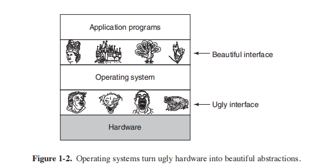

It should be noted that the operating system’s real customers are the application programs (via the application programmers, of course). They are the ones who deal directly with the operating system and its abstractions. In contrast, end users deal with the abstractions provided by the user interface, either a command-line shell or a graphical interface. While the abstractions at the user interface
may be similar to the ones provided by the operating system, this is not always the case. To make this point clearer, consider the normal Windows desktop and the line-oriented command prompt. Both are programs running on the Windows operating system and use the abstractions Windows provides, but they offer very different user interfaces. Similarly, a Linux user running Gnome or KDE sees a very different interface than a Linux user working directly on top of the underlying X Window System, but the underlying operating system abstractions are the same in both cases.

_Perlu dicatat bahwa pelanggan nyata sistem operasi adalah program aplikasi (melalui pemrogram aplikasi, tentu saja). Merekalah yang berhubungan langsung dengan sistem operasi dan abstraksinya. Sebaliknya, pengguna akhir berurusan dengan abstraksi yang disediakan oleh antarmuka pengguna, baik shell baris perintah atau antarmuka grafis. Sementara abstraksi di antarmuka pengguna
mungkin mirip dengan yang disediakan oleh sistem operasi, hal ini tidak selalu terjadi. Untuk memperjelas poin ini, pertimbangkan desktop Windows normal dan command prompt berorientasi baris. Keduanya adalah program yang berjalan pada sistem operasi Windows dan menggunakan abstraksi yang disediakan Windows, tetapi keduanya menawarkan antarmuka pengguna yang sangat berbeda. Demikian pula, pengguna Linux yang menjalankan Gnome atau KDE melihat antarmuka yang sangat berbeda dari pengguna Linux yang bekerja langsung di atas Sistem X Window yang mendasarinya, tetapi abstraksi sistem operasi yang mendasarinya sama dalam kedua kasus._

In this book, we will study the abstractions provided to application programs in great detail, but say rather little about user interfaces. That is a large and important subject, but one only peripherally related to operating systems.

_Dalam buku ini, kita akan mempelajari abstraksi yang disediakan untuk program aplikasi dengan sangat rinci, tetapi sedikit membahas tentang antarmuka pengguna. Itu adalah subjek yang besar dan penting, tetapi hanya satu yang terkait dengan sistem operasi._

#### 1.1.2 The Operating System as a Resource Manager

_1.1.2 Sistem Operasi sebagai Resource Manager_

The concept of an operating system as primarily providing abstractions to application programs is a top-down view. An alternative, bottom-up, view holds that the operating system is there to manage all the pieces of a complex system. Modern computers consist of processors, memories, timers, disks, mice, network interfaces, printers, and a wide variety of other devices. In the bottom-up view, the job of the operating system is to provide for an orderly and controlled allocation of the processors, memories, and I/O devices among the various programs wanting them.

_Konsep sistem operasi yang menyediakan abstraksi untuk program aplikasi adalah pandangan dari atas ke bawah. Pandangan alternatif, bottom-up, menyatakan bahwa sistem operasi ada untuk mengelola semua bagian dari sistem yang kompleks. Komputer modern terdiri dari prosesor, memori, timer, disk, mouse, antarmuka jaringan, printer, dan berbagai perangkat lainnya. Dalam pandangan bottom-up, tugas sistem operasi adalah menyediakan alokasi prosesor, memori, dan perangkat I/O yang teratur dan terkendali di antara berbagai program yang menginginkannya._

Modern operating systems allow multiple programs to be in memory and run at the same time. Imagine what would happen if three programs running on some computer all tried to print their output simultaneously on the same printer. The first few lines of printout might be from program 1, the next few from program 2, then
some from program 3, and so forth. The result would be utter chaos. The operating system can bring order to the potential chaos by buffering all the output destined for the printer on the disk. When one program is finished, the operating system can then copy its output from the disk file where it has been stored for the printer, while at the same time the other program can continue generating more output, oblivious to the fact that the output is not really going to the printer (yet).

_Sistem operasi modern memungkinkan beberapa program berada di memori dan dijalankan pada saat yang bersamaan. Bayangkan apa yang akan terjadi jika tiga program yang berjalan di beberapa komputer mencoba mencetak outputnya secara bersamaan pada printer yang sama. Beberapa baris cetakan pertama mungkin berasal dari program 1, beberapa baris berikutnya dari program 2, lalu beberapa dari program 3, dan sebagainya. Hasilnya akan menjadi kekacauan total. Sistem operasi dapat menertibkan potensi kekacauan dengan buffering semua output yang ditujukan untuk printer pada disk. Ketika satu program selesai, sistem operasi kemudian dapat menyalin outputnya dari file disk yang telah disimpan untuk printer, sementara pada saat yang sama program lain dapat terus menghasilkan lebih banyak output, tidak menyadari fakta bahwa output tidak benar-benar pergi ke printer (belum)._

When a computer (or network) has more than one user, the need for managing and protecting the memory, I/O devices, and other resources is even more since the users might otherwise interfere with one another. In addition, users often need to share not only hardware, but information (files, databases, etc.) as well. In short, this view of the operating system holds that its primary task is to keep track of which programs are using which resource, to grant resource requests, to account for usage, and to mediate conflicting requests from different programs and users.

_Ketika komputer (atau jaringan) memiliki lebih dari satu pengguna, kebutuhan untuk mengelola dan melindungi memori, perangkat I/O, dan sumber daya lainnya bahkan lebih karena pengguna dapat mengganggu satu sama lain. Selain itu, pengguna sering kali perlu berbagi tidak hanya perangkat keras, tetapi juga informasi (file, database, dll.). Singkatnya, pandangan sistem operasi ini menyatakan bahwa tugas utamanya adalah untuk melacak program mana yang menggunakan sumber daya mana, untuk mengabulkan permintaan sumber daya, untuk memperhitungkan penggunaan, dan untuk menengahi permintaan yang bertentangan dari program dan pengguna yang berbeda._

Resource management includes **multiplexing** (sharing) resources in two different ways: in time and in space. When a resource is time multiplexed, different programs or users take turns using it. First one of them gets to use the resource, then another, and so on. For example, with only one CPU and multiple programs that want to run on it, the operating system first allocates the CPU to one program, then, after it has run long enough, another program gets to use the CPU, then another, and then eventually the first one again. Determining how the resource is time multiplexed—who goes next and for how long—is the task of the operating system. Another example of time multiplexing is sharing the printer. When multiple print jobs are queued up for printing on a single printer, a decision has to be made about which one is to be printed next.

_Manajemen sumber daya mencakup **multiplexing** (berbagi) sumber daya dalam dua cara berbeda: dalam waktu dan dalam ruang. Ketika sumber daya di-multipleks waktu, program atau pengguna yang berbeda secara bergiliran menggunakannya. Pertama salah satu dari mereka dapat menggunakan sumber daya, lalu yang lain, dan seterusnya. Misalnya, dengan hanya satu CPU dan beberapa program yang ingin dijalankan di dalamnya, sistem operasi pertama-tama mengalokasikan CPU ke satu program, kemudian, setelah berjalan cukup lama, program lain akan menggunakan CPU, lalu yang lain, dan kemudian akhirnya yang pertama lagi. Menentukan bagaimana sumber daya di-multipleks-waktu—siapa yang pergi berikutnya dan untuk berapa lama—adalah tugas sistem operasi. Contoh lain dari multiplexing waktu adalah berbagi printer. Ketika beberapa pekerjaan cetak diantrekan untuk dicetak pada satu printer, keputusan harus dibuat tentang mana yang akan dicetak berikutnya._

The other kind of multiplexing is space multiplexing. Instead of the customers taking turns, each one gets part of the resource. For example, main memory is normally divided up among several running programs, so each one can be resident at the same time (for example, in order to take turns using the CPU). Assuming there is enough memory to hold multiple programs, it is more efficient to hold several programs in memory at once rather than give one of them all of it, especially if it only needs a small fraction of the total. Of course, this raises issues of fairness, protection, and so on, and it is up to the operating system to solve them. Another resource that is space multiplexed is the disk. In many systems a single disk can
hold files from many users at the same time. Allocating disk space and keeping track of who is using which disk blocks is a typical operating system task.

_Jenis multiplexing lainnya adalah space multiplexing. Alih-alih pelanggan bergiliran, masing-masing mendapat bagian dari sumber daya. Sebagai contoh, memori utama biasanya dibagi di antara beberapa program yang sedang berjalan, sehingga masing-masing program dapat digunakan secara bersamaan (misalnya, untuk menggunakan CPU secara bergiliran). Dengan asumsi ada cukup memori untuk menampung beberapa program, lebih efisien untuk menyimpan beberapa program dalam memori sekaligus daripada memberikan salah satu dari mereka semua, terutama jika hanya membutuhkan sebagian kecil dari total. Tentu saja, ini menimbulkan masalah keadilan, perlindungan, dan sebagainya, dan terserah pada sistem operasi untuk menyelesaikannya. Sumber daya lain yang di-multiplexing adalah disk. Dalam banyak sistem, satu disk dapat
menyimpan file dari banyak pengguna secara bersamaan. Mengalokasikan ruang disk dan melacak siapa yang menggunakan blok disk mana yang merupakan tugas khas sistem operasi._

### 1.2 HISTORY OF OPERATING SYSTEMS

_1.2 SEJARAH SISTEM OPERASI_

Operating systems have been evolving through the years. In the following sections we will briefly look at a few of the highlights. Since operating systems have historically been closely tied to the architecture of the computers on which they run, we will look at successive generations of computers to see what their operating systems were like. This mapping of operating system generations to computer generations is crude, but it does provide some structure where there would otherwise be none.

_Sistem operasi telah berkembang selama bertahun-tahun. Pada bagian berikut kita akan melihat secara singkat beberapa sorotan. Karena sistem operasi secara historis terkait erat dengan arsitektur komputer tempat mereka menjalankannya, kita akan melihat generasi komputer yang berurutan untuk melihat seperti apa sistem operasi mereka. Pemetaan generasi sistem operasi ke generasi komputer ini masih mentah, tetapi memberikan beberapa struktur yang tidak akan ada._

The progression given below is largely chronological, but it has been a bumpy ride. Each development did not wait until the previous one nicely finished before getting started. There was a lot of overlap, not to mention many false starts and dead ends. Take this as a guide, not as the last word.

_Perkembangan yang diberikan di bawah ini sebagian besar kronologis, tetapi perjalanannya bergelombang. Setiap pengembangan tidak menunggu sampai yang sebelumnya selesai dengan baik sebelum memulai. Ada banyak tumpang tindih, belum lagi banyak awal yang salah dan jalan buntu. Ambil ini sebagai panduan, bukan sebagai kata terakhir._

The first true digital computer was designed by the English mathematician Charles Babbage (1792–1871). Although Babbage spent most of his life and fortune trying to build his ‘‘analytical engine,’’ he never got it working properly because it was purely mechanical, and the technology of his day could not produce the required wheels, gears, and cogs to the high precision that he needed. Needless to say, the analytical engine did not have an operating system.

_Komputer digital sejati pertama dirancang oleh matematikawan Inggris Charles Babbage (1792–1871). Meskipun Babbage menghabiskan sebagian besar hidup dan kekayaannya untuk mencoba membangun "mesin analitiknya", ia tidak pernah berhasil membuatnya bekerja dengan baik karena mesin itu murni mekanis, dan teknologi pada zamannya tidak dapat menghasilkan roda, roda gigi, dan roda gigi yang diperlukan untuk presisi tinggi yang dia butuhkan. Tak perlu dikatakan, mesin analitik tidak memiliki sistem operasi._

As an interesting historical aside, Babbage realized that he would need software for his analytical engine, so he hired a young woman named Ada Lovelace, who was the daughter of the famed British poet Lord Byron, as the world’s first programmer. The programming language Ada® is named after her.

_Sebagai tambahan sejarah yang menarik, Babbage menyadari bahwa dia akan membutuhkan perangkat lunak untuk mesin analitiknya, jadi dia mempekerjakan seorang wanita muda bernama Ada Lovelace, yang merupakan putri penyair Inggris terkenal Lord Byron, sebagai programmer pertama di dunia. Bahasa pemrograman Ada® dinamai menurut namanya._

#### 1.2.1 The First Generation (1945–55): Vacuum Tubes

_1.2.1 Generasi Pertama (1945–55): Tabung Vakum_

After Babbage’s unsuccessful efforts, little progress was made in constructing digital computers until the World War II period, which stimulated an explosion of activity. Professor John Atanasoff and his graduate student Clifford Berry built what is now reg arded as the first functioning digital computer at Iowa State University. It used 300 vacuum tubes. At roughly the same time, Konrad Zuse in Berlin
built the Z3 computer out of electromechanical relays. In 1944, the Colossus was built and programmed by a group of scientists (including Alan Turing) at Bletchley Park, England, the Mark I was built by Howard Aiken at Harvard, and the ENIAC was built by William Mauchley and his graduate student J. Presper Eckert at the
University of Pennsylvania. Some were binary, some used vacuum tubes, some were programmable, but all were very primitive and took seconds to perform even the simplest calculation.

_Setelah upaya Babbage yang gagal, hanya sedikit kemajuan yang dibuat dalam membangun komputer digital hingga periode Perang Dunia II, yang merangsang ledakan aktivitas. Profesor John Atanasoff dan mahasiswa pascasarjananya Clifford Berry membangun apa yang sekarang disebut sebagai komputer digital pertama yang berfungsi di Iowa State University. Ini digunakan 300 tabung vakum. Pada waktu yang hampir bersamaan, Konrad Zuse di Berlin
membangun komputer Z3 dari relai elektromekanis. Pada tahun 1944, Colossus dibangun dan diprogram oleh sekelompok ilmuwan (termasuk Alan Turing) di Bletchley Park, Inggris, Mark I dibangun oleh Howard Aiken di Harvard, dan ENIAC dibangun oleh William Mauchley dan mahasiswa pascasarjananya J. Presper Eckert di Universitas Pennsylvania. Beberapa adalah biner, beberapa menggunakan tabung vakum, beberapa dapat diprogram, tetapi semuanya sangat primitif dan membutuhkan waktu beberapa detik untuk melakukan perhitungan yang paling sederhana sekalipun._

In these early days, a single group of people (usually engineers) designed, built, programmed, operated, and maintained each machine. All programming was done in absolute machine language, or even worse yet, by wiring up electrical circuits by connecting thousands of cables to plugboards to control the machine’s basic functions. Programming languages were unknown (even assembly language was unknown). Operating systems were unheard of. The usual mode of operation was for the programmer to sign up for a block of time using the signup sheet on the wall, then come down to the machine room, insert his or her plugboard into the computer, and spend the next few hours hoping that none of the 20,000 or so vacuum tubes would burn out during the run. Virtually all the problems were simple straightforward mathematical and numerical calculations, such as grinding out tables of sines, cosines, and logarithms, or computing artillery trajectories.

_Pada hari-hari awal ini, sekelompok orang (biasanya insinyur) merancang, membangun, memprogram, mengoperasikan, dan memelihara setiap mesin. Semua pemrograman dilakukan dalam bahasa mesin mutlak, atau bahkan lebih buruk lagi, dengan memasang kabel sirkuit listrik dengan menghubungkan ribuan kabel ke plugboard untuk mengontrol fungsi dasar mesin. Bahasa pemrograman tidak diketahui (bahkan bahasa assembly tidak diketahui). Sistem operasi tidak pernah terdengar sebelumnya. Modus operasi yang biasa adalah untuk programmer untuk mendaftar untuk blok waktu menggunakan lembar pendaftaran di dinding, kemudian turun ke ruang mesin, memasukkan plugboard-nya ke komputer, dan menghabiskan beberapa jam berikutnya berharap bahwa tak satu pun dari 20.000 atau lebih tabung vakum akan terbakar selama menjalankan. Hampir semua masalah adalah perhitungan matematis dan numerik yang sederhana, seperti menggiling tabel sinus, cosinus, dan logaritma, atau menghitung lintasan artileri._

By the early 1950s, the routine had improved somewhat with the introduction of punched cards. It was now possible to write programs on cards and read them in instead of using plugboards; otherwise, the procedure was the same.

_Pada awal 1950-an, rutinitas itu agak membaik dengan diperkenalkannya kartu berlubang. Sekarang dimungkinkan untuk menulis program pada kartu dan membacanya alih-alih menggunakan plugboard; jika tidak, prosedurnya sama._

#### 1.2.2 The Second Generation (1955–65): Transistors and Batch Systems

_1.2.2 Generasi Kedua (1955–65): Transistor dan Sistem Batch_

The introduction of the transistor in the mid-1950s changed the picture radically. Computers became reliable enough that they could be manufactured and sold to paying customers with the expectation that they would continue to function long enough to get some useful work done. For the first time, there was a clear separation between designers, builders, operators, programmers, and maintenance personnel.

_Pengenalan transistor pada pertengahan 1950-an mengubah gambaran secara radikal. Komputer menjadi cukup andal sehingga dapat diproduksi dan dijual kepada pelanggan yang membayar dengan harapan bahwa mereka akan terus berfungsi cukup lama untuk menyelesaikan pekerjaan yang bermanfaat. Untuk pertama kalinya, ada pemisahan yang jelas antara desainer, pembangun, operator, pemrogram, dan personel pemeliharaan._

These machines, now called **mainframes**, were locked away in large, specially air-conditioned computer rooms, with staffs of professional operators to run them. Only large corporations or major government agencies or universities could afford the multimillion-dollar price tag. To run a **job** (i.e., a program or set of programs), a programmer would first write the program on paper (in FORTRAN or assembler), then punch it on cards. He would then bring the card deck down to the input room and hand it to one of the operators and go drink coffee until the output was ready.

_Mesin-mesin ini, yang sekarang disebut **mainframe**, dikunci dalam ruang komputer yang besar dan khusus ber-AC, dengan staf operator profesional untuk menjalankannya. Hanya perusahaan besar atau lembaga pemerintah atau universitas besar yang mampu membayar harga jutaan dolar. Untuk menjalankan **pekerjaan** (yaitu, program atau kumpulan program), seorang programmer pertama-tama akan menulis program di atas kertas (dalam FORTRAN atau assembler), kemudian memencetnya pada kartu. Dia kemudian akan membawa dek kartu ke ruang input dan menyerahkannya ke salah satu operator dan pergi minum kopi sampai output siap._

When the computer finished whatever job it was currently running, an operator would go over to the printer and tear off the output and carry it over to the output room, so that the programmer could collect it later. Then he would take one of the card decks that had been brought from the input room and read it in. If the FORTRAN compiler was needed, the operator would have to get it from a file cabinet and read it in. Much computer time was wasted while operators were walking around the machine room.

_Ketika komputer menyelesaikan pekerjaan apa pun yang sedang berjalan, operator akan pergi ke printer dan merobek output dan membawanya ke ruang output, sehingga programmer dapat mengumpulkannya nanti. Kemudian dia akan mengambil salah satu tumpukan kartu yang telah dibawa dari ruang input dan membacanya. Jika kompiler FORTRAN diperlukan, operator harus mengambilnya dari lemari arsip dan membacanya. Banyak waktu komputer yang terbuang sia-sia. sementara operator berjalan di sekitar ruang mesin._

Given the high cost of the equipment, it is not surprising that people quickly looked for ways to reduce the wasted time. The solution generally adopted was the **batch system**. The idea behind it was to collect a tray full of jobs in the input room and then read them onto a magnetic tape using a small (relatively) inexpensive computer, such as the IBM 1401, which was quite good at reading cards, copying tapes, and printing output, but not at all good at numerical calculations. Other, much more expensive machines, such as the IBM 7094, were used for the real computing. This situation is shown in Fig. 1-3.

_Mengingat tingginya biaya peralatan, tidak mengherankan jika orang dengan cepat mencari cara untuk mengurangi waktu yang terbuang. Solusi yang umumnya diadopsi adalah **sistem batch**. Ide di baliknya adalah untuk mengumpulkan nampan penuh pekerjaan di ruang input dan kemudian membacanya ke pita magnetik menggunakan komputer kecil (relatif) murah, seperti IBM 1401, yang cukup bagus dalam membaca kartu, menyalin kaset, dan hasil cetak, tetapi sama sekali tidak pandai dalam perhitungan numerik. Mesin lain yang jauh lebih mahal, seperti IBM 7094, digunakan untuk komputasi sebenarnya. Situasi ini ditunjukkan pada Gambar. 1-3._

After about an hour of collecting a batch of jobs, the cards were read onto a magnetic tape, which was carried into the machine room, where it was mounted on a tape drive. The operator then loaded a special program (the ancestor of today’s operating system), which read the first job from tape and ran it. The output was written onto a second tape, instead of being printed. After each job finished, the operating system automatically read the next job from the tape and began running it. When the whole batch was done, the operator removed the input and output tapes, replaced the input tape with the next batch, and brought the output tape to a 1401 for printing **off line** (i.e., not connected to the main computer).

_Setelah sekitar satu jam mengumpulkan sejumlah pekerjaan, kartu-kartu itu dibacakan ke pita magnetik, yang dibawa ke ruang mesin, di mana kartu itu dipasang pada tape drive. Operator kemudian memuat program khusus (nenek moyang sistem operasi saat ini), yang membaca pekerjaan pertama dari tape dan menjalankannya. Outputnya ditulis ke kaset kedua, bukannya dicetak. Setelah setiap pekerjaan selesai, sistem operasi secara otomatis membaca pekerjaan berikutnya dari kaset dan mulai menjalankannya. Ketika seluruh batch selesai, operator melepas pita input dan output, mengganti pita input dengan batch berikutnya, dan membawa pita keluaran ke 1401 untuk dicetak secara **offline** (yaitu, tidak terhubung ke komputer utama)._

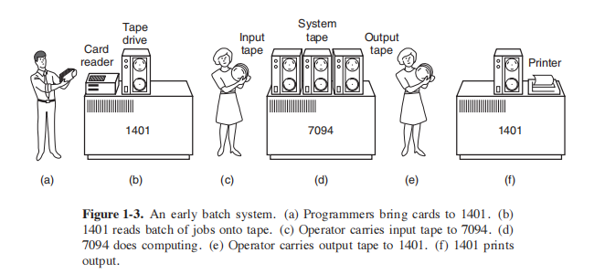

The structure of a typical input job is shown in Fig. 1-4. It started out with a $JOB card, specifying the maximum run time in minutes, the account number to be charged, and the programmer’s name. Then came a $FORTRAN card, telling the operating system to load the FORTRAN compiler from the system tape. It was directly followed by the program to be compiled, and then a $LOAD card, directing the operating system to load the object program just compiled. (Compiled programs were often written on scratch tapes and had to be loaded explicitly.) Next came the $RUN card, telling the operating system to run the program with the data following it. Finally, the $END card marked the end of the job. These primitive control cards were the forerunners of modern shells and command-line interpreters.

_Struktur pekerjaan input tipikal ditunjukkan pada Gambar. 1-4. Ini dimulai dengan kartu $JOB, menentukan waktu berjalan maksimum dalam hitungan menit, nomor akun yang akan ditagih, dan nama programmer. Kemudian datang sebuah kartu $FORTRAN, memberitahu sistem operasi untuk memuat kompiler FORTRAN dari pita sistem. Itu langsung diikuti oleh program yang akan dikompilasi, dan kemudian kartu $LOAD, mengarahkan sistem operasi untuk memuat program objek yang baru saja dikompilasi. (Program yang dikompilasi sering ditulis pada kaset awal dan harus dimuat secara eksplisit.) Berikutnya adalah kartu $RUN, memberitahu sistem operasi untuk menjalankan program dengan data yang mengikutinya. Akhirnya, kartu $END menandai akhir dari pekerjaan. Kartu kontrol primitif ini adalah cikal bakal shell modern dan interpreter baris perintah._

Large second-generation computers were used mostly for scientific and engineering calculations, such as solving the partial differential equations that often occur in physics and engineering. They were largely programmed in FORTRAN and assembly language. Typical operating systems were FMS (the Fortran Monitor System) and IBSYS, IBM’s operating system for the 7094.

_Komputer generasi kedua yang besar sebagian besar digunakan untuk perhitungan ilmiah dan teknik, seperti memecahkan persamaan diferensial parsial yang sering terjadi dalam fisika dan teknik. Mereka sebagian besar diprogram dalam FORTRAN dan bahasa assembly. Sistem operasi yang umum adalah FMS (Fortran Monitor System) dan IBSYS, sistem operasi IBM untuk 7094._

#### 1.2.3 The Third Generation (1965–1980): ICs and Multiprogramming

_1.2.3 Generasi Ketiga (1965–1980): IC dan Multiprogramming_

By the early 1960s, most computer manufacturers had two distinct, incompatible, product lines. On the one hand, there were the word-oriented, large-scale scientific computers, such as the 7094, which were used for industrial-strength numerical calculations in science and engineering. On the other hand, there were the character-oriented, commercial computers, such as the 1401, which were widely used for tape sorting and printing by banks and insurance companies.

_Pada awal 1960-an, sebagian besar produsen komputer memiliki dua lini produk yang berbeda dan tidak kompatibel. Di satu sisi, ada komputer ilmiah skala besar yang berorientasi pada kata, seperti 7094, yang digunakan untuk perhitungan numerik kekuatan industri dalam sains dan teknik. Di sisi lain, ada komputer komersial yang berorientasi pada karakter, seperti 1401, yang banyak digunakan untuk menyortir dan mencetak pita oleh bank dan perusahaan asuransi._

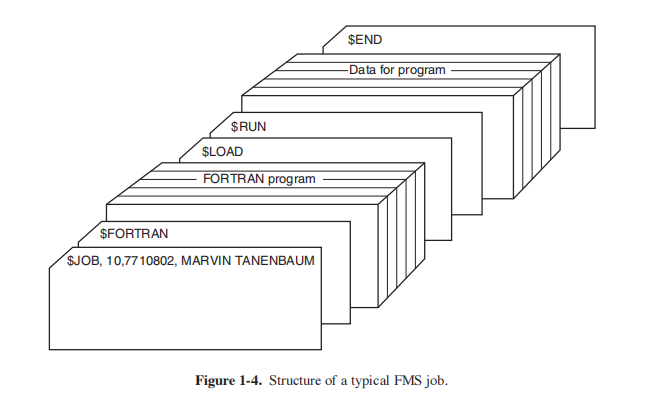

Developing and maintaining two completely different product lines was an expensive proposition for the manufacturers. In addition, many new computer customers initially needed a small machine but later outgrew it and wanted a bigger machine that would run all their old programs, but faster.

_Mengembangkan dan memelihara dua lini produk yang sama sekali berbeda merupakan proposisi yang mahal bagi produsen. Selain itu, banyak pelanggan komputer baru pada awalnya membutuhkan mesin kecil tetapi kemudian menjadi lebih besar dan menginginkan mesin yang lebih besar yang akan menjalankan semua program lama mereka, tetapi lebih cepat._

IBM attempted to solve both of these problems at a single stroke by introducing the System/360. The 360 was a series of software-compatible machines ranging from 1401-sized models to much larger ones, more powerful than the mighty 7094. The machines differed only in price and performance (maximum memory, processor speed, number of I/O devices permitted, and so forth). Since they all had the same architecture and instruction set, programs written for one machine could run on all the others—at least in theory. (But as Yogi Berra reputedly said: ‘‘In theory, theory and practice are the same; in practice, they are not.’’) Since the 360 was designed to handle both scientific (i.e., numerical) and commercial computing, a single family of machines could satisfy the needs of all customers. In subsequent years, IBM came out with backward compatible successors to the 360 line, using more modern technology, known as the 370, 4300, 3080, and 3090. The zSeries is the most recent descendant of this line, although it has diverged considerably from the original.

_IBM berusaha untuk memecahkan kedua masalah ini dengan satu pukulan dengan memperkenalkan System/360. 360 adalah serangkaian mesin yang kompatibel dengan perangkat lunak mulai dari model berukuran 1401 hingga yang jauh lebih besar, lebih bertenaga daripada 7094 yang perkasa. Mesin-mesin tersebut hanya berbeda dalam harga dan kinerja (memori maksimum, kecepatan prosesor, jumlah perangkat I/O yang diizinkan , Dan seterusnya). Karena semuanya memiliki arsitektur dan set instruksi yang sama, program yang ditulis untuk satu mesin dapat berjalan di mesin lainnya—setidaknya secara teori. (Tapi seperti yang dikatakan Yogi Berra: '' Secara teori, teori dan praktik adalah sama; dalam praktiknya tidak.'') Karena 360 dirancang untuk menangani komputasi ilmiah (yaitu, numerik) dan komersial, satu keluarga mesin bisa memenuhi kebutuhan semua pelanggan. Pada tahun-tahun berikutnya, IBM keluar dengan penerus yang kompatibel ke belakang ke garis 360, menggunakan teknologi yang lebih modern, yang dikenal sebagai 370, 4300, 3080, dan 3090. zSeries adalah keturunan terbaru dari garis ini, meskipun telah menyimpang jauh dari asli._

The IBM 360 was the first major computer line to use (small-scale) **ICs (Integrated Circuits)**, thus providing a major price/performance advantage over the second-generation machines, which were built up from individual transistors. It was an immediate success, and the idea of a family of compatible computers was soon adopted by all the other major manufacturers. The descendants of these machines are still in use at computer centers today. Now adays they are often used for managing huge databases (e.g., for airline reservation systems) or as servers for World Wide Web sites that must process thousands of requests per second.

_IBM 360 adalah lini komputer besar pertama yang menggunakan **IC (Sirkuit Terpadu)** (skala kecil), sehingga memberikan keunggulan harga/kinerja utama dibandingkan mesin generasi kedua, yang dibuat dari masing-masing transistor. Itu sukses langsung, dan gagasan keluarga komputer yang kompatibel segera diadopsi oleh semua produsen besar lainnya. Keturunan dari mesin ini masih digunakan di pusat komputer sampai sekarang. Sekarang mereka sering digunakan untuk mengelola database besar (misalnya, untuk sistem reservasi maskapai penerbangan) atau sebagai server untuk situs World Wide Web yang harus memproses ribuan permintaan per detik._

The greatest strength of the ‘‘single-family’’ idea was simultaneously its greatest weakness. The original intention was that all software, including the operating system, **OS/360**, had to work on all models. It had to run on small systems, which often just replaced 1401s for copying cards to tape, and on very large systems, which often replaced 7094s for doing weather forecasting and other heavy computing. It had to be good on systems with few peripherals and on systems with many peripherals. It had to work in commercial environments and in scientific environments. Above all, it had to be efficient for all of these different uses.

_Kekuatan terbesar dari ide '' keluarga tunggal '' secara bersamaan adalah kelemahan terbesarnya. Niat awalnya adalah bahwa semua perangkat lunak, termasuk sistem operasi, **OS/360**, harus bekerja pada semua model. Itu harus berjalan pada sistem kecil, yang sering hanya menggantikan 1401 untuk menyalin kartu ke tape, dan pada sistem yang sangat besar, yang sering menggantikan 7094 untuk melakukan prakiraan cuaca dan komputasi berat lainnya. Itu harus bagus pada sistem dengan sedikit periferal dan pada sistem dengan banyak periferal. Itu harus bekerja di lingkungan komersial dan di lingkungan ilmiah. Di atas segalanya, itu harus efisien untuk semua kegunaan yang berbeda ini._

There was no way that IBM (or anybody else for that matter) could write a piece of software to meet all those conflicting requirements. The result was an enormous and extraordinarily complex operating system, probably two to three orders of magnitude larger than FMS. It consisted of millions of lines of assembly language written by thousands of programmers, and contained thousands upon thousands of bugs, which necessitated a continuous stream of new releases in an attempt to correct them. Each new release fixed some bugs and introduced new ones, so the number of bugs probably remained constant over time.

_Tidak mungkin IBM (atau siapa pun dalam hal ini) dapat menulis perangkat lunak untuk memenuhi semua persyaratan yang saling bertentangan itu. Hasilnya adalah sistem operasi yang sangat besar dan luar biasa kompleks, mungkin dua atau tiga kali lipat lebih besar dari FMS. Ini terdiri dari jutaan baris bahasa rakitan yang ditulis oleh ribuan programmer, dan berisi ribuan bug, yang memerlukan aliran rilis baru yang berkelanjutan dalam upaya untuk memperbaikinya. Setiap rilis baru memperbaiki beberapa bug dan memperkenalkan yang baru, sehingga jumlah bug mungkin tetap konstan dari waktu ke waktu._

One of the designers of OS/360, Fred Brooks, subsequently wrote a witty and incisive book (Brooks, 1995) describing his experiences with OS/360. While it would be impossible to summarize the book here, suffice it to say that the cover shows a herd of prehistoric beasts stuck in a tar pit. The cover of Silberschatz et al. (2012) makes a similar point about operating systems being dinosaurs.

_Salah satu desainer OS/360, Fred Brooks, kemudian menulis sebuah buku yang cerdas dan tajam (Brooks, 1995) yang menjelaskan pengalamannya dengan OS/360. Meskipun tidak mungkin untuk meringkas buku di sini, cukuplah untuk mengatakan bahwa sampulnya menunjukkan sekawanan binatang prasejarah yang terjebak di lubang ter. Sampul Silberschatz dkk. (2012) membuat poin serupa tentang sistem operasi yang menjadi dinosaurus._

Despite its enormous size and problems, OS/360 and the similar third-generation operating systems produced by other computer manufacturers actually satisfied most of their customers reasonably well. They also popularized several key techniques absent in second-generation operating systems. Probably the most important of these was **multiprogramming**. On the 7094, when the current job paused to wait for a tape or other I/O operation to complete, the CPU simply sat idle until the I/O finished. With heavily CPU-bound scientific calculations, I/O is infrequent, so this wasted time is not significant. With commercial data processing, the I/O wait time can often be 80 or 90% of the total time, so something had to be done to avoid having the (expensive) CPU be idle so much.

_Terlepas dari ukuran dan masalahnya yang sangat besar, OS/360 dan sistem operasi generasi ketiga serupa yang diproduksi oleh produsen komputer lain sebenarnya cukup memuaskan sebagian besar pelanggan mereka. Mereka juga mempopulerkan beberapa teknik kunci yang tidak ada dalam sistem operasi generasi kedua. Mungkin yang paling penting adalah **multiprogramming**. Pada 7094, ketika pekerjaan saat ini dihentikan sementara untuk menunggu rekaman atau operasi I/O lainnya selesai, CPU hanya diam sampai I/O selesai. Dengan perhitungan ilmiah yang sangat terikat CPU, I/O jarang terjadi, jadi waktu yang terbuang ini tidak signifikan. Dengan pemrosesan data komersial, waktu tunggu I/O seringkali bisa mencapai 80 atau 90% dari total waktu, jadi sesuatu harus dilakukan untuk menghindari CPU (mahal) menganggur begitu banyak._

The solution that evolved was to partition memory into several pieces, with a different job in each partition, as shown in Fig. 1-5. While one job was waiting for I/O to complete, another job could be using the CPU. If enough jobs could be held in main memory at once, the CPU could be kept busy nearly 100% of the time. Having multiple jobs safely in memory at once requires special hardware to protect each job against snooping and mischief by the other ones, but the 360 and other third-generation systems were equipped with this hardware.

_Solusi yang berkembang adalah dengan mempartisi memori menjadi beberapa bagian, dengan job yang berbeda pada setiap partisi, seperti ditunjukkan pada Gambar 1-5. Sementara satu pekerjaan menunggu I/O selesai, pekerjaan lain mungkin menggunakan CPU. Jika cukup banyak pekerjaan yang dapat disimpan di memori utama sekaligus, CPU dapat tetap sibuk hampir 100% sepanjang waktu. Memiliki beberapa pekerjaan dengan aman di memori sekaligus memerlukan perangkat keras khusus untuk melindungi setiap pekerjaan dari pengintaian dan kerusakan oleh pekerjaan lainnya, tetapi 360 dan sistem generasi ketiga lainnya dilengkapi dengan perangkat keras ini._

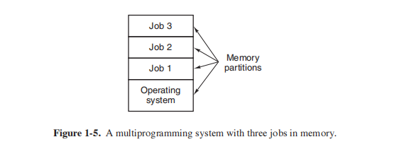

Another major feature present in third-generation operating systems was the ability to read jobs from cards onto the disk as soon as they were brought to the computer room. Then, whenever a running job finished, the operating system could load a new job from the disk into the now-empty partition and run it. This technique is called **spooling** (from **Simultaneous Peripheral Operation On Line**) and was also used for output. With spooling, the 1401s were no longer needed, and
much carrying of tapes disappeared.

_Fitur utama lain yang ada dalam sistem operasi generasi ketiga adalah kemampuan untuk membaca pekerjaan dari kartu ke disk segera setelah dibawa ke ruang komputer. Kemudian, setiap kali pekerjaan yang sedang berjalan selesai, sistem operasi dapat memuat pekerjaan baru dari disk ke dalam partisi yang sekarang kosong dan menjalankannya. Teknik ini disebut **spooling** (dari **Simultaneous Peripheral Operation On Line**) dan juga digunakan untuk output. Dengan spooling, 1401 tidak lagi diperlukan, dan banyak kaset hilang._

Although third-generation operating systems were well suited for big scientific calculations and massive commercial data-processing runs, they were still basically batch systems. Many programmers pined for the first-generation days when they had the machine all to themselves for a few hours, so they could debug their programs quickly. With third-generation systems, the time between submitting a job and getting back the output was often several hours, so a single misplaced comma could cause a compilation to fail, and the programmer to waste half a day. Programmers did not like that very much.

_Meskipun sistem operasi generasi ketiga sangat cocok untuk perhitungan ilmiah besar dan pemrosesan data komersial besar-besaran, mereka pada dasarnya masih sistem batch. Banyak programmer merindukan hari-hari generasi pertama ketika mereka memiliki mesin untuk diri mereka sendiri selama beberapa jam, sehingga mereka dapat men-debug program mereka dengan cepat. Dengan sistem generasi ketiga, waktu antara mengirimkan pekerjaan dan mendapatkan kembali hasilnya seringkali beberapa jam, sehingga satu koma yang salah tempat dapat menyebabkan kompilasi gagal, dan pemrogram membuang waktu setengah hari. Programmer tidak begitu menyukainya._

This desire for quick response time paved the way for **timesharing**, a variant of multiprogramming, in which each user has an online terminal. In a timesharing system, if 20 users are logged in and 17 of them are thinking or talking or drinking coffee, the CPU can be allocated in turn to the three jobs that want service. Since people debugging programs usually issue short commands (e.g., compile a five page procedure†) rather than long ones (e.g., sort a million-record file), the computer can provide fast, interactive service to a number of users and perhaps also work on big batch jobs in the background when the CPU is otherwise idle. The first general-purpose timesharing system, **CTSS (Compatible Time Sharing System)**, was developed at M.I.T. on a specially modified 7094 (Corbato´ et al., 1962). However, timesharing did not really become popular until the necessary protection hardware became widespread during the third generation.

_Keinginan akan waktu respons yang cepat ini membuka jalan bagi **pembagian waktu**, varian dari multiprogramming, di mana setiap pengguna memiliki terminal online. Dalam sistem pembagian waktu, jika 20 pengguna masuk dan 17 di antaranya berpikir atau berbicara atau minum kopi, CPU dapat dialokasikan secara bergantian ke tiga pekerjaan yang menginginkan layanan. Karena orang yang men-debug program biasanya mengeluarkan perintah pendek (misalnya, mengkompilasi prosedur lima halaman†) daripada yang panjang (misalnya, mengurutkan satu juta file rekaman), komputer dapat menyediakan layanan yang cepat dan interaktif ke sejumlah pengguna dan mungkin juga berfungsi pada pekerjaan batch besar di latar belakang saat CPU tidak digunakan. Sistem timesharing tujuan umum pertama, **CTSS (Compatible Time Sharing System)**, dikembangkan di M.I.T. pada 7094 yang dimodifikasi secara khusus (Corbato´ et al., 1962). Namun, pembagian waktu tidak benar-benar menjadi populer sampai perangkat keras perlindungan yang diperlukan tersebar luas selama generasi ketiga._

After the success of the CTSS system, M.I.T., Bell Labs, and General Electric (at that time a major computer manufacturer) decided to embark on the development of a ‘‘computer utility,’’ that is, a machine that would support some hundreds

>`†We will use the terms ‘‘procedure,’’ ‘‘subroutine,’’ and ‘‘function’’ interchangeably in this book.`

of simultaneous timesharing users. Their model was the electricity system—when you need electric power, you just stick a plug in the wall, and within reason, as much power as you need will be there. The designers of this system, known as **MULTICS (MULTiplexed Information and Computing Service)**, envisioned one huge machine providing computing power for everyone in the Boston area. The idea that machines 10,000 times faster than their GE-645 mainframe would be sold (for well under $1000) by the millions only 40 years later was pure science fiction. Sort of like the idea of supersonic trans-Atlantic undersea trains now.

_Setelah keberhasilan sistem CTSS, M.I.T., Bell Labs, dan General Electric (pada waktu itu merupakan produsen komputer besar) memutuskan untuk memulai pengembangan "utilitas komputer", yaitu, mesin yang akan mendukung beberapa ratus_

>_`Kami akan menggunakan istilah ''prosedur'', ''subrutin,'' dan ''fungsi'' secara bergantian dalam buku ini.`_

 _pengguna timesharing simultan. Model mereka adalah sistem kelistrikan—ketika Anda membutuhkan daya listrik, Anda cukup memasang steker di dinding, dan dengan alasan yang wajar, daya sebanyak yang Anda butuhkan akan tersedia di sana. Perancang sistem ini, yang dikenal sebagai **MULTICS (MULTiplexed Information and Computing Service)**, membayangkan satu mesin besar yang menyediakan daya komputasi untuk semua orang di wilayah Boston. Gagasan bahwa mesin 10.000 kali lebih cepat dari mainframe GE-645 mereka akan dijual (dengan harga di bawah $1000) oleh jutaan hanya 40 tahun kemudian adalah fiksi ilmiah murni. Semacam ide kereta bawah laut supersonik trans-Atlantik sekarang._

MULTICS was a mixed success. It was designed to support hundreds of users on a machine only slightly more powerful than an Intel 386 based PC, although it had much more I/O capacity. This is not quite as crazy as it sounds, since in those days people knew how to write small, efficient programs, a skill that has subsequently been completely lost. There were many reasons that MULTICS did not take over the world, not the least of which is that it was written in the PL/I programming language, and the PL/I compiler was years late and barely worked at all when it finally arrived. In addition, MULTICS was enormously ambitious for its time, much like Charles Babbage’s analytical engine in the nineteenth century.

_MULTICS adalah sukses campuran. Itu dirancang untuk mendukung ratusan pengguna pada mesin yang hanya sedikit lebih kuat daripada PC berbasis Intel 386, meskipun memiliki kapasitas I/O yang jauh lebih besar. Ini tidak terlalu gila kedengarannya, karena pada masa itu orang tahu cara menulis program kecil yang efisien, keterampilan yang kemudian benar-benar hilang. Ada banyak alasan mengapa MULTICS tidak mengambil alih dunia, salah satunya adalah karena MULTICS ditulis dalam bahasa pemrograman PL/I, dan kompiler PL/I terlambat bertahun-tahun dan hampir tidak berfungsi sama sekali ketika akhirnya tiba. Selain itu, MULTICS sangat ambisius pada masanya, seperti mesin analitik Charles Babbage di abad kesembilan belas._

To make a long story short, MULTICS introduced many seminal ideas into the computer literature, but turning it into a serious product and a major commercial success was a lot harder than anyone had expected. Bell Labs dropped out of the project, and General Electric quit the computer business altogether. Howev er, M.I.T. persisted and eventually got MULTICS working. It was ultimately sold as a commercial product by the company (Honeywell) that bought GE’s computer business and was installed by about 80 major companies and universities worldwide. While their numbers were small, MULTICS users were fiercely loyal. General Motors, Ford, and the U.S. National Security Agency, for example, shut down their MULTICS systems only in the late 1990s, 30 years after MULTICS was released, after years of trying to get Honeywell to update the hardware.

_Untuk membuat cerita panjang pendek, MULTICS memperkenalkan banyak ide mani ke dalam literatur komputer, tetapi mengubahnya menjadi produk yang serius dan sukses komersial besar jauh lebih sulit daripada yang diharapkan siapa pun. Bell Labs keluar dari proyek, dan General Electric keluar dari bisnis komputer sama sekali. Namun, M.I.T. bertahan dan akhirnya membuat MULTICS bekerja. Itu akhirnya dijual sebagai produk komersial oleh perusahaan (Honeywell) yang membeli bisnis komputer GE dan dipasang oleh sekitar 80 perusahaan besar dan universitas di seluruh dunia. Meskipun jumlahnya sedikit, pengguna MULTICS sangat setia. General Motors, Ford, dan U.S. National Security Agency, misalnya, mematikan sistem MULTICS mereka hanya pada akhir 1990-an, 30 tahun setelah MULTICS dirilis, setelah bertahun-tahun mencoba membuat Honeywell memperbarui perangkat kerasnya._

By the end of the 20th century, the concept of a computer utility had fizzled out, but it may well come back in the form of **cloud computing**, in which relatively small computers (including smartphones, tablets, and the like) are connected to servers in vast and distant data centers where all the computing is done, with the local computer just handling the user interface. The motivation here is that most people do not want to administrate an increasingly complex and finicky computer system and would prefer to have that work done by a team of professionals, for example, people working for the company running the data center. E-commerce is already evolving in this direction, with various companies running emails on multiprocessor servers to which simple client machines connect, very much in the spirit of the MULTICS design.

_Pada akhir abad ke-20, konsep utilitas komputer telah gagal, tetapi mungkin kembali dalam bentuk **komputasi awan**, di mana komputer yang relatif kecil (termasuk smartphone, tablet, dan sejenisnya) terhubung ke server. di pusat data yang luas dan jauh di mana semua komputasi dilakukan, dengan komputer lokal hanya menangani antarmuka pengguna. Motivasinya di sini adalah kebanyakan orang tidak ingin mengelola sistem komputer yang semakin kompleks dan rewel dan lebih suka pekerjaan itu dilakukan oleh tim profesional, misalnya, orang yang bekerja untuk perusahaan yang menjalankan pusat data. E-commerce sudah berkembang ke arah ini, dengan berbagai perusahaan menjalankan email di server multiprosesor yang terhubung dengan mesin klien sederhana, sangat sesuai dengan semangat desain MULTICS._

Despite its lack of commercial success, MULTICS had a huge influence on subsequent operating systems (especially UNIX and its derivatives, FreeBSD, Linux, iOS, and Android). It is described in several papers and a book (Corbato´ et al., 1972; Corbato´ and Vyssotsky, 1965; Daley and Dennis, 1968; Organick, 1972; and Saltzer, 1974). It also has an active Website, located at www.multicians.org, with much information about the system, its designers, and its users.

_Meskipun kurang sukses secara komersial, MULTICS memiliki pengaruh besar pada sistem operasi berikutnya (terutama UNIX dan turunannya, FreeBSD, Linux, iOS, dan Android). Hal ini dijelaskan dalam beberapa makalah dan buku (Corbato´ et al., 1972; Corbato´ dan Vyssotsky, 1965; Daley dan Dennis, 1968; Organick, 1972; dan Saltzer, 1974). Ia juga memiliki Situs Web aktif, yang terletak di www.multicians.org, dengan banyak informasi tentang sistem, perancangnya, dan penggunanya._

Another major development during the third generation was the phenomenal growth of minicomputers, starting with the DEC PDP-1 in 1961. The PDP-1 had only 4K of 18-bit words, but at $120,000 per machine (less than 5% of the price of a 7094), it sold like hotcakes. For certain kinds of nonnumerical work, it was almost as fast as the 7094 and gav e birth to a whole new industry. It was quickly followed by a series of other PDPs (unlike IBM’s family, all incompatible) culminating in the PDP-11.

_Perkembangan besar lainnya selama generasi ketiga adalah pertumbuhan komputer mini yang fenomenal, dimulai dengan DEC PDP-1 pada tahun 1961. PDP-1 hanya memiliki 4K kata 18-bit, tetapi pada $120.000 per mesin (kurang dari 5% dari harga dari 7094), itu dijual seperti kacang goreng. Untuk jenis pekerjaan nonnumerik tertentu, itu hampir secepat tahun 7094 dan melahirkan industri yang sama sekali baru. Itu dengan cepat diikuti oleh serangkaian PDP lain (tidak seperti keluarga IBM, semuanya tidak kompatibel) yang berpuncak pada PDP-11._

One of the computer scientists at Bell Labs who had worked on the MULTICS project, Ken Thompson, subsequently found a small PDP-7 minicomputer that no one was using and set out to write a stripped-down, one-user version of MULTICS. This work later developed into the **UNIX** operating system, which became popular in the academic world, with government agencies, and with many companies.

_Salah satu ilmuwan komputer di Bell Labs yang pernah mengerjakan proyek MULTICS, Ken Thompson, kemudian menemukan komputer mini PDP-7 kecil yang tidak digunakan siapa pun dan mulai menulis versi MULTICS satu pengguna yang dilucuti. Karya ini kemudian berkembang menjadi sistem operasi **UNIX**, yang menjadi populer di dunia akademis, dengan instansi pemerintah, dan dengan banyak perusahaan._

The history of UNIX has been told elsewhere (e.g., Salus, 1994). Part of that story will be given in Chap. 10. For now, suffice it to say that because the source code was widely available, various organizations developed their own (incompatible) versions, which led to chaos. Two major versions developed, **System V**, from AT&T, and **BSD (Berkeley Software Distribution)** from the University of California at Berkeley. These had minor variants as well. To make it possible to write programs that could run on any UNIX system, IEEE developed a standard for UNIX, called **POSIX**, that most versions of UNIX now support. POSIX defines a minimal system-call interface that conformant UNIX systems must support. In fact, some other operating systems now also support the POSIX interface.

_Sejarah UNIX telah diceritakan di tempat lain (misalnya, Salus, 1994). Bagian dari cerita itu akan diberikan di Bab. 10. Untuk saat ini, cukup untuk mengatakan bahwa karena kode sumber tersedia secara luas, berbagai organisasi mengembangkan versi mereka sendiri (tidak kompatibel), yang menyebabkan kekacauan. Dua versi utama dikembangkan, **System V**, dari AT&T, dan **BSD (Berkeley Software Distribution)** dari University of California di Berkeley. Ini memiliki varian kecil juga. Untuk memungkinkan penulisan program yang dapat berjalan pada sistem UNIX apa pun, IEEE mengembangkan standar untuk UNIX, yang disebut **POSIX**, yang sekarang didukung oleh sebagian besar versi UNIX. POSIX mendefinisikan antarmuka panggilan sistem minimal yang harus didukung oleh sistem UNIX yang sesuai. Bahkan, beberapa sistem operasi lain sekarang juga mendukung antarmuka POSIX._

As an aside, it is worth mentioning that in 1987, the author released a small clone of UNIX, called **MINIX**, for educational purposes. Functionally, MINIX is very similar to UNIX, including POSIX support. Since that time, the original version has evolved into MINIX 3, which is highly modular and focused on very high reliability. It has the ability to detect and replace faulty or even crashed modules (such as I/O device drivers) on the fly without a reboot and without disturbing running programs. Its focus is on providing very high dependability and availability. A book describing its internal operation and listing the source code in an appendix is also available (Tanenbaum and Woodhull, 2006). The MINIX 3 system is available for free (including all the source code) over the Internet at www.minix3.org.

_Sebagai tambahan, perlu disebutkan bahwa pada tahun 1987, penulis merilis tiruan kecil UNIX, yang disebut **MINIX**, untuk tujuan pendidikan. Secara fungsional, MINIX sangat mirip dengan UNIX, termasuk dukungan POSIX. Sejak saat itu, versi aslinya telah berkembang menjadi MINIX 3, yang sangat modular dan berfokus pada keandalan yang sangat tinggi. Ia memiliki kemampuan untuk mendeteksi dan mengganti modul yang rusak atau bahkan macet (seperti driver perangkat I/O) dengan cepat tanpa reboot dan tanpa mengganggu program yang sedang berjalan. Fokusnya adalah menyediakan ketergantungan dan ketersediaan yang sangat tinggi. Sebuah buku yang menjelaskan operasi internal dan daftar kode sumber dalam lampiran juga tersedia (Tanenbaum dan Woodhull, 2006). Sistem MINIX 3 tersedia secara gratis (termasuk semua kode sumber) melalui Internet di www.minix3.org._

The desire for a free production (as opposed to educational) version of MINIX led a Finnish student, Linus Torvalds, to write **Linux**. This system was directly inspired by and developed on MINIX and originally supported various MINIX features (e.g., the MINIX file system). It has since been extended in many ways by many people but still retains some underlying structure common to MINIX and to
UNIX. Readers interested in a detailed history of Linux and the open source movement might want to read Glyn Moody’s (2001) book. Most of what will be said about UNIX in this book thus applies to System V, MINIX, Linux, and other versions and clones of UNIX as well.

_Keinginan untuk produksi gratis (sebagai lawan dari pendidikan) versi MINIX memimpin seorang mahasiswa Finlandia, Linus Torvalds, untuk menulis **Linux**. Sistem ini secara langsung terinspirasi dan dikembangkan pada MINIX dan awalnya mendukung berbagai fitur MINIX (mis., Sistem file MINIX). Sejak itu telah diperluas dalam banyak cara oleh banyak orang tetapi masih mempertahankan beberapa struktur dasar yang umum untuk MINIX dan untuk
UNIX. Pembaca yang tertarik dengan sejarah rinci Linux dan gerakan open source mungkin ingin membaca buku Glyn Moody (2001). Sebagian besar dari apa yang akan dikatakan tentang UNIX dalam buku ini dengan demikian berlaku untuk Sistem V, MINIX, Linux, dan juga versi dan klon UNIX lainnya._

#### 1.2.4 The Fourth Generation (1980–Present): Personal Computers

_1.2.4 Generasi Keempat (1980–Sekarang): Komputer Pribadi_

With the development of **LSI (Large Scale Integration)** circuits—chips containing thousands of transistors on a square centimeter of silicon—the age of the personal computer dawned. In terms of architecture, personal computers (initially called **microcomputers**) were not all that different from minicomputers of the PDP-11 class, but in terms of price they certainly were different. Where the minicomputer made it possible for a department in a company or university to have its own computer, the microprocessor chip made it possible for a single individual to have his or her own personal computer.

_Dengan berkembangnya sirkuit **LSI (Large Scale Integration)**—chip yang berisi ribuan transistor pada satu sentimeter persegi silikon—usia komputer pribadi mulai muncul. Dari segi arsitektur, komputer pribadi (awalnya disebut **mikrokomputer**) tidak jauh berbeda dengan minikomputer kelas PDP-11, namun dari segi harga tentu berbeda. Di mana komputer mini memungkinkan departemen di perusahaan atau universitas untuk memiliki komputer sendiri, chip mikroprosesor memungkinkan satu individu untuk memiliki komputer pribadinya sendiri._

In 1974, when Intel came out with the 8080, the first general-purpose 8-bit CPU, it wanted an operating system for the 8080, in part to be able to test it. Intel asked one of its consultants, Gary Kildall, to write one. Kildall and a friend first built a controller for the newly released Shugart Associates 8-inch floppy disk and hooked the floppy disk up to the 8080, thus producing the first microcomputer with a disk. Kildall then wrote a disk-based operating system called **CP/M (Control Program for Microcomputers)** for it. Since Intel did not think that disk-based microcomputers had much of a future, when Kildall asked for the rights to CP/M, Intel granted his request. Kildall then formed a company, Digital Research, to further develop and sell CP/M.

_Pada tahun 1974, ketika Intel mengeluarkan 8080, CPU 8-bit tujuan umum pertama, ia menginginkan sistem operasi untuk 8080, sebagian untuk dapat mengujinya. Intel meminta salah satu konsultannya, Gary Kildall, untuk menulisnya. Kildall dan seorang teman pertama kali membuat pengontrol untuk floppy disk 8 inci Shugart Associates yang baru dirilis dan menghubungkan floppy disk ke 8080, sehingga menghasilkan komputer mikro pertama dengan disk. Kildall kemudian menulis sistem operasi berbasis disk yang disebut **CP/M (Program Kontrol untuk Mikrokomputer)** untuk itu. Karena Intel tidak berpikir bahwa mikrokomputer berbasis disk memiliki banyak masa depan, ketika Kildall meminta hak atas CP/M, Intel mengabulkan permintaannya. Kildall kemudian membentuk sebuah perusahaan, Digital Research, untuk lebih mengembangkan dan menjual CP/M._

In 1977, Digital Research rewrote CP/M to make it suitable for running on the many microcomputers using the 8080, Zilog Z80, and other CPU chips. Many application programs were written to run on CP/M, allowing it to completely dominate the world of microcomputing for about 5 years.

_Pada tahun 1977, Digital Research menulis ulang CP/M agar sesuai untuk dijalankan di banyak mikrokomputer yang menggunakan 8080, Zilog Z80, dan chip CPU lainnya. Banyak program aplikasi yang ditulis untuk dijalankan pada CP/M, memungkinkannya untuk sepenuhnya mendominasi dunia mikrokomputer selama sekitar 5 tahun._

In the early 1980s, IBM designed the IBM PC and looked around for software to run on it. People from IBM contacted Bill Gates to license his BASIC interpreter. They also asked him if he knew of an operating system to run on the PC. Gates suggested that IBM contact Digital Research, then the world’s dominant operating systems company. Making what was surely the worst business decision in recorded history, Kildall refused to meet with IBM, sending a subordinate instead. To make matters even worse, his lawyer even refused to sign IBM’s nondisclosure agreement covering the not-yet-announced PC. Consequently, IBM went back to Gates asking if he could provide them with an operating system.

_Pada awal 1980-an, IBM merancang PC IBM dan mencari-cari perangkat lunak untuk menjalankannya. Orang-orang dari IBM menghubungi Bill Gates untuk melisensikan penerjemah BASIC-nya. Mereka juga bertanya apakah dia tahu sistem operasi yang bisa dijalankan di PC. Gates menyarankan agar IBM menghubungi Digital Research, yang saat itu merupakan perusahaan sistem operasi yang dominan di dunia. Membuat apa yang pasti merupakan keputusan bisnis terburuk dalam sejarah yang tercatat, Kildall menolak untuk bertemu dengan IBM, sebagai gantinya mengirim bawahan. Lebih buruk lagi, pengacaranya bahkan menolak menandatangani perjanjian kerahasiaan IBM yang mencakup PC yang belum diumumkan. Akibatnya, IBM kembali ke Gates menanyakan apakah dia bisa memberi mereka sistem operasi._

When IBM came back, Gates realized that a local computer manufacturer, Seattle Computer Products, had a suitable operating system, **DOS (Disk Operating System)**. He approached them and asked to buy it (allegedly for $75,000), which they readily accepted. Gates then offered IBM a DOS/BASIC package, which IBM accepted. IBM wanted certain modifications, so Gates hired the person who wrote DOS, Tim Paterson, as an employee of Gates’ fledgling company,  Microsoft, to make them. The revised system was renamed **MS-DOS (MicroSoft Disk Operating System)** and quickly came to dominate the IBM PC market. A key factor here was Gates’ (in retrospect, extremely wise) decision to sell MS-DOS to computer companies for bundling with their hardware, compared to Kildall’s attempt to sell CP/M to end users one at a time (at least initially). After all this transpired, Kildall died suddenly and unexpectedly from causes that have not been fully disclosed.

_Ketika IBM kembali, Gates menyadari bahwa produsen komputer lokal, Seattle Computer Products, memiliki sistem operasi yang sesuai, **DOS (Disk Operating System)**. Dia mendekati mereka dan meminta untuk membelinya (diduga seharga $75.000), yang dengan mudah mereka terima. Gates kemudian menawarkan paket DOS/BASIC kepada IBM, yang diterima IBM. IBM menginginkan modifikasi tertentu, jadi Gates mempekerjakan orang yang menulis DOS, Tim Paterson, sebagai karyawan perusahaan baru Gates, Microsoft, untuk membuatnya. Sistem yang direvisi berganti nama menjadi **MS-DOS (MicroSoft Disk Operating System)** dan dengan cepat mendominasi pasar PC IBM. Faktor kunci di sini adalah keputusan Gates (dalam retrospeksi, sangat bijaksana) untuk menjual MS-DOS ke perusahaan komputer untuk bundling dengan perangkat keras mereka, dibandingkan dengan upaya Kildall untuk menjual CP/M kepada pengguna akhir satu per satu (setidaknya pada awalnya) . Setelah semua ini terjadi, Kildall meninggal secara tiba-tiba dan tidak terduga dari penyebab yang belum sepenuhnya diungkapkan._

By the time the successor to the IBM PC, the IBM PC/AT, came out in 1983 with the Intel 80286 CPU, MS-DOS was firmly entrenched and CP/M was on its last legs. MS-DOS was later widely used on the 80386 and 80486. Although the initial version of MS-DOS was fairly primitive, subsequent versions included more advanced features, including many taken from UNIX. (Microsoft was well aware of UNIX, even selling a microcomputer version of it called XENIX during the
company’s early years.)

_Pada saat penerus IBM PC, IBM PC/AT, keluar pada tahun 1983 dengan CPU Intel 80286, MS-DOS telah tertanam kuat dan CP/M berada di kaki terakhirnya. MS-DOS kemudian digunakan secara luas pada 80386 dan 80486. Meskipun versi awal MS-DOS cukup primitif, versi selanjutnya menyertakan fitur yang lebih canggih, termasuk banyak yang diambil dari UNIX. (Microsoft sangat menyadari UNIX, bahkan menjual versi komputer mikro yang disebut XENIX selama tahun-tahun awal perusahaan.)_

CP/M, MS-DOS, and other operating systems for early microcomputers were all based on users typing in commands from the keyboard. That eventually changed due to research done by Doug Engelbart at Stanford Research Institute in the 1960s. Engelbart invented the Graphical User Interface, complete with windows, icons, menus, and mouse. These ideas were adopted by researchers at Xerox PARC and incorporated into machines they built.

_CP/M, MS-DOS, dan sistem operasi lain untuk mikrokomputer awal semuanya didasarkan pada pengguna yang mengetikkan perintah dari keyboard. Itu akhirnya berubah karena penelitian yang dilakukan oleh Doug Engelbart di Stanford Research Institute pada 1960-an. Engelbart menemukan Graphical User Interface, lengkap dengan jendela, ikon, menu, dan mouse. Ide-ide ini diadopsi oleh para peneliti di Xerox PARC dan dimasukkan ke dalam mesin yang mereka buat._

One day, Steve Jobs, who co-invented the Apple computer in his garage, visited PARC, saw a GUI, and instantly realized its potential value, something Xerox management famously did not. This strategic blunder of gargantuan proportions led to a book entitled Fumbling the Future (Smith and Alexander, 1988). Jobs then embarked on building an Apple with a GUI. This project led to the Lisa, which was too expensive and failed commercially. Jobs’ second attempt, the Apple Macintosh, was a huge success, not only because it was much cheaper than the Lisa, but also because it was **user friendly**, meaning that it was intended for users who not only knew nothing about computers but furthermore had absolutely no intention whatsoever of learning. In the creative world of graphic design, professional digital photography, and professional digital video production, Macintoshes are very widely used and their users are very enthusiastic about them. In 1999, Apple adopted a kernel derived from Carnegie Mellon University’s Mach microkernel which was originally developed to replace the kernel of BSD UNIX. Thus, **Mac OS X** is a UNIX-based operating system, albeit with a very distinctive interface.

_Suatu hari, Steve Jobs, yang ikut menciptakan komputer Apple di garasinya, mengunjungi PARC, melihat GUI, dan langsung menyadari nilai potensialnya, sesuatu yang tidak diketahui oleh manajemen Xerox. Kesalahan strategis dengan proporsi raksasa ini menghasilkan sebuah buku berjudul Meraba-raba Masa Depan (Smith dan Alexander, 1988). Jobs kemudian mulai membangun Apple dengan GUI. Proyek ini menyebabkan Lisa, yang terlalu mahal dan gagal secara komersial. Upaya kedua Jobs, Apple Macintosh, sukses besar, bukan hanya karena jauh lebih murah daripada Lisa, tetapi juga karena **ramah pengguna**, artinya ditujukan untuk pengguna yang tidak hanya tahu apa-apa tentang komputer tetapi juga memiliki sama sekali tidak ada niat untuk belajar. Dalam dunia kreatif desain grafis, fotografi digital profesional, dan produksi video digital profesional, Macintoshes sangat banyak digunakan dan sangat antusias penggunanya. Pada tahun 1999, Apple mengadopsi kernel yang berasal dari mikrokernel Mach Carnegie Mellon University yang awalnya dikembangkan untuk menggantikan kernel BSD UNIX. Dengan demikian, **Mac OS X** adalah sistem operasi berbasis UNIX, meskipun dengan antarmuka yang sangat khas._

When Microsoft decided to build a successor to MS-DOS, it was strongly influenced by the success of the Macintosh. It produced a GUI-based system called Windows, which originally ran on top of MS-DOS (i.e., it was more like a shell than a true operating system). For about 10 years, from 1985 to 1995, Windows was just a graphical environment on top of MS-DOS. However, starting in 1995 a freestanding version, Windows 95, was released that incorporated many operating system features into it, using the underlying MS-DOS system only for booting and running old MS-DOS programs. In 1998, a slightly modified version of this system, called Windows 98 was released. Nevertheless, both Windows 95 and Windows 98 still contained a large amount of 16-bit Intel assembly language.

_Ketika Microsoft memutuskan untuk membangun penerus MS-DOS, itu sangat dipengaruhi oleh keberhasilan Macintosh. Ini menghasilkan sistem berbasis GUI yang disebut Windows, yang awalnya berjalan di atas MS-DOS (yaitu, itu lebih seperti shell daripada sistem operasi yang sebenarnya). Selama sekitar 10 tahun, dari 1985 hingga 1995, Windows hanyalah lingkungan grafis di atas MS-DOS. Namun, mulai tahun 1995 versi berdiri bebas, Windows 95, dirilis yang memasukkan banyak fitur sistem operasi ke dalamnya, menggunakan sistem MS-DOS yang mendasarinya hanya untuk mem-boot dan menjalankan program MS-DOS lama. Pada tahun 1998, versi yang sedikit dimodifikasi dari sistem ini, yang disebut Windows 98 dirilis. Namun demikian, baik Windows 95 dan Windows 98 masih mengandung sejumlah besar bahasa rakitan Intel 16-bit._

Another Microsoft operating system, **Windows NT** (where the NT stands for **New Technology**), which was compatible with Windows 95 at a certain level, but a complete rewrite from scratch internally. It was a full 32-bit system. The lead designer for Windows NT was David Cutler, who was also one of the designers of the VAX VMS operating system, so some ideas from VMS are present in NT. In fact, so many ideas from VMS were present in it that the owner of VMS, DEC, sued Microsoft. The case was settled out of court for an amount of money requiring many digits to express. Microsoft expected that the first version of NT would kill off MS-DOS and all other versions of Windows since it was a vastly superior system, but it fizzled. Only with Windows NT 4.0 did it finally catch on in a big way, especially on corporate networks. Version 5 of Windows NT was renamed Windows 2000 in early 1999. It was intended to be the successor to both Windows 98 and Windows NT 4.0.

_Sistem operasi Microsoft lainnya, **Windows NT** (di mana NT adalah singkatan dari **Teknologi Baru**), yang kompatibel dengan Windows 95 pada tingkat tertentu, tetapi menulis ulang lengkap dari awal secara internal. Itu adalah sistem 32-bit penuh. Perancang utama untuk Windows NT adalah David Cutler, yang juga merupakan salah satu perancang sistem operasi VAX VMS, sehingga beberapa ide dari VMS hadir di NT. Bahkan, begitu banyak ide dari VMS yang hadir di dalamnya sehingga pemilik VMS, DEC, menggugat Microsoft. Kasus ini diselesaikan di luar pengadilan untuk sejumlah uang yang membutuhkan banyak digit untuk diungkapkan. Microsoft berharap bahwa versi pertama NT akan mematikan MS-DOS dan semua versi Windows lainnya karena ini adalah sistem yang jauh lebih unggul, tetapi gagal. Hanya dengan Windows NT 4.0 yang akhirnya berkembang pesat, terutama di jaringan korporat. Versi 5 Windows NT berganti nama menjadi Windows 2000 pada awal 1999. Ini dimaksudkan untuk menjadi penerus Windows 98 dan Windows NT 4.0._

That did not quite work out either, so Microsoft came out with yet another version of Windows 98 called **Windows Me (Millennium Edition)**. In 2001, a slightly upgraded version of Windows 2000, called Windows XP was released. That version had a much longer run (6 years), basically replacing all previous versions of Windows.

_Itu juga tidak berhasil, jadi Microsoft mengeluarkan versi lain dari Windows 98 yang disebut **Windows Me (Edisi Milenium)**. Pada tahun 2001, versi Windows 2000 yang sedikit ditingkatkan, yang disebut Windows XP dirilis. Versi itu berjalan lebih lama (6 tahun), pada dasarnya menggantikan semua versi Windows sebelumnya._

Still the spawning of versions continued unabated. After Windows 2000, Microsoft broke up the Windows family into a client and a server line. The client line was based on XP and its successors, while the server line included Windows Server 2003 and Windows 2008. A third line, for the embedded world, appeared a little later. All of these versions of Windows forked off their variations in the form of **service packs**. It was enough to drive some administrators (and writers of operating systems textbooks) balmy.

_Masih pemijahan versi terus berlanjut. Setelah Windows 2000, Microsoft memecah keluarga Windows menjadi klien dan baris server. Baris klien didasarkan pada XP dan penerusnya, sedangkan baris server termasuk Windows Server 2003 dan Windows 2008. Baris ketiga, untuk dunia tertanam, muncul beberapa saat kemudian. Semua versi Windows ini mengubah variasinya dalam bentuk **paket layanan**. Itu sudah cukup untuk membuat beberapa administrator (dan penulis buku teks sistem operasi) nyaman._

Then in January 2007, Microsoft finally released the successor to Windows XP, called Vista. It came with a new graphical interface, improved security, and many new or upgraded user programs. Microsoft hoped it would replace Windows XP completely, but it never did. Instead, it received much criticism and a bad press, mostly due to the high system requirements, restrictive licensing terms, and support for **Digital Rights Management**, techniques that made it harder for users to copy protected material.

_Kemudian pada Januari 2007, Microsoft akhirnya merilis penerus Windows XP, bernama Vista. Itu datang dengan antarmuka grafis baru, keamanan yang ditingkatkan, dan banyak program pengguna baru atau yang ditingkatkan. Microsoft berharap itu akan menggantikan Windows XP sepenuhnya, tetapi tidak pernah terjadi. Sebaliknya, itu menerima banyak kritik dan pers yang buruk, sebagian besar karena persyaratan sistem yang tinggi, persyaratan lisensi yang ketat, dan dukungan untuk **Manajemen Hak Digital**, teknik yang mempersulit pengguna untuk menyalin materi yang dilindungi._

With the arrival of Windows 7, a new and much less resource hungry version of the operating system, many people decided to skip Vista altogether. Windows 7 did not introduce too many new features, but it was relatively small and quite stable. In less than three weeks, Windows 7 had obtained more market share than Vista in seven months. In 2012, Microsoft launched its successor, Windows 8, an operating system with a completely new look and feel, geared for touch screens. The company hopes that the new design will become the dominant operating system on a much wider variety of devices: desktops, laptops, notebooks, tablets, phones, and home theater PCs. So far, howev er, the market penetration is slow compared to Windows 7.

_Dengan kedatangan Windows 7, versi sistem operasi yang baru dan jauh lebih sedikit sumber daya, banyak orang memutuskan untuk melewatkan Vista sama sekali. Windows 7 tidak memperkenalkan terlalu banyak fitur baru, tetapi relatif kecil dan cukup stabil. Dalam waktu kurang dari tiga minggu, Windows 7 telah memperoleh lebih banyak pangsa pasar daripada Vista dalam tujuh bulan. Pada tahun 2012, Microsoft meluncurkan penggantinya, Windows 8, sebuah sistem operasi dengan tampilan dan nuansa yang benar-benar baru, ditujukan untuk layar sentuh. Perusahaan berharap bahwa desain baru akan menjadi sistem operasi yang dominan pada berbagai perangkat yang lebih luas: desktop, laptop, notebook, tablet, ponsel, dan PC home theater. Namun sejauh ini penetrasi pasarnya lambat dibandingkan dengan Windows 7._

The other major contender in the personal computer world is UNIX (and its various derivatives). UNIX is strongest on network and enterprise servers but is also often present on desktop computers, notebooks, tablets, and smartphones. On x86-based computers, Linux is becoming a popular alternative to Windows for students and increasingly many corporate users.

_Pesaing utama lainnya di dunia komputer pribadi adalah UNIX (dan berbagai turunannya). UNIX paling kuat di server jaringan dan perusahaan tetapi juga sering hadir di komputer desktop, notebook, tablet, dan smartphone. Pada komputer berbasis x86, Linux menjadi alternatif populer untuk Windows bagi pelajar dan semakin banyak pengguna korporat._

As an aside, throughout this book we will use the term **x86** to refer to all modern processors based on the family of instruction-set architectures that started with the 8086 in the 1970s. There are many such processors, manufactured by companies like AMD and Intel, and under the hood they often differ considerably: processors may be 32 bits or 64 bits with few or many cores and pipelines that may be deep or shallow, and so on. Nevertheless, to the programmer, they all look quite similar and they can all still run 8086 code that was written 35 years ago. Where the difference is important, we will refer to explicit models instead—and use **x86-32** and **x86-64** to indicate 32-bit and 64-bit variants.

_Sebagai tambahan, di seluruh buku ini kita akan menggunakan istilah **x86** untuk merujuk pada semua prosesor modern berdasarkan keluarga arsitektur set instruksi yang dimulai dengan 8086 pada 1970-an. Ada banyak prosesor seperti itu, yang diproduksi oleh perusahaan seperti AMD dan Intel, dan di bawah tenda mereka sering sangat berbeda: prosesor mungkin 32 bit atau 64 bit dengan sedikit atau banyak inti dan saluran pipa yang mungkin dalam atau dangkal, dan seterusnya. Namun demikian, bagi programmer, mereka semua terlihat sangat mirip dan mereka semua masih dapat menjalankan kode 8086 yang ditulis 35 tahun yang lalu. Jika perbedaannya penting, kami akan merujuk ke model eksplisit sebagai gantinya—dan menggunakan **x86-32** dan **x86-64** untuk menunjukkan varian 32-bit dan 64-bit._

**FreeBSD** is also a popular UNIX derivative, originating from the BSD project at Berkeley. All modern Macintosh computers run a modified version of FreeBSD (OS X). UNIX is also standard on workstations powered by high-performance RISC chips. Its derivatives are widely used on mobile devices, such as those running iOS 7 or Android.

_**FreeBSD** juga merupakan turunan UNIX yang populer, yang berasal dari proyek BSD di Berkeley. Semua komputer Macintosh modern menjalankan versi FreeBSD (OS X) yang dimodifikasi. UNIX juga merupakan standar pada workstation yang didukung oleh chip RISC berkinerja tinggi. Turunannya banyak digunakan pada perangkat seluler, seperti yang menjalankan iOS 7 atau Android._

Many UNIX users, especially experienced programmers, prefer a commandbased interface to a GUI, so nearly all UNIX systems support a windowing system called the **X Window System** (also known as **X11**) produced at M.I.T. This system handles the basic window management, allowing users to create, delete, move, and resize windows using a mouse. Often a complete GUI, such as **Gnome** or **KDE**, is available to run on top of X11, giving UNIX a look and feel something like the Macintosh or Microsoft Windows, for those UNIX users who want such a thing.

_Banyak pengguna UNIX, terutama programmer berpengalaman, lebih memilih antarmuka berbasis perintah daripada GUI, sehingga hampir semua sistem UNIX mendukung sistem windowing yang disebut **Sistem X Window** (juga dikenal sebagai **X11**) yang diproduksi di M.I.T. Sistem ini menangani manajemen jendela dasar, memungkinkan pengguna untuk membuat, menghapus, memindahkan, dan mengubah ukuran jendela menggunakan mouse. Seringkali GUI lengkap, seperti **Gnome** atau **KDE**, tersedia untuk dijalankan di atas X11, memberikan UNIX tampilan dan nuansa seperti Macintosh atau Microsoft Windows, bagi pengguna UNIX yang menginginkan hal seperti itu._

An interesting development that began taking place during the mid-1980s is the growth of networks of personal computers running **network operating systems** and **distributed operating systems** (Tanenbaum and Van Steen, 2007). In a network operating system, the users are aware of the existence of multiple computers and can log in to remote machines and copy files from one machine to another. Each machine runs its own local operating system and has its own local user (or users).

_Perkembangan menarik yang mulai terjadi pada pertengahan tahun 1980-an adalah pertumbuhan jaringan komputer pribadi yang menjalankan **sistem operasi jaringan** dan **sistem operasi terdistribusi** (Tanenbaum dan Van Steen, 2007). Dalam sistem operasi jaringan, pengguna menyadari keberadaan beberapa komputer dan dapat masuk ke mesin jarak jauh dan menyalin file dari satu mesin ke mesin lainnya. Setiap mesin menjalankan sistem operasi lokalnya sendiri dan memiliki pengguna (atau pengguna) lokalnya sendiri._

Network operating systems are not fundamentally different from single-processor operating systems. They obviously need a network interface controller and some low-level software to drive it, as well as programs to achieve remote login and remote file access, but these additions do not change the essential structure of the operating system.

_Sistem operasi jaringan pada dasarnya tidak berbeda dari sistem operasi prosesor tunggal. Mereka jelas membutuhkan pengontrol antarmuka jaringan dan beberapa perangkat lunak tingkat rendah untuk menjalankannya, serta program untuk mencapai login jarak jauh dan akses file jarak jauh, tetapi penambahan ini tidak mengubah struktur penting sistem operasi._

A distributed operating system, in contrast, is one that appears to its users as a traditional uniprocessor system, even though it is actually composed of multiple processors. The users should not be aware of where their programs are being run or where their files are located; that should all be handled automatically and efficiently by the operating system.

_Sebuah sistem operasi terdistribusi, sebaliknya, adalah salah satu yang tampak kepada penggunanya sebagai sistem uniprosesor tradisional, meskipun sebenarnya terdiri dari beberapa prosesor. Pengguna tidak boleh mengetahui di mana program mereka dijalankan atau di mana file mereka berada; yang semuanya harus ditangani secara otomatis dan efisien oleh sistem operasi._

True distributed operating systems require more than just adding a little code to a uniprocessor operating system, because distributed and centralized systems differ in certain critical ways. Distributed systems, for example, often allow applications to run on several processors at the same time, thus requiring more complex processor scheduling algorithms in order to optimize the amount of parallelism.

_Sistem operasi terdistribusi yang sebenarnya membutuhkan lebih dari sekadar menambahkan sedikit kode ke sistem operasi uniprosesor, karena sistem terdistribusi dan terpusat berbeda dalam cara-cara kritis tertentu. Sistem terdistribusi, misalnya, sering mengizinkan aplikasi untuk berjalan pada beberapa prosesor secara bersamaan, sehingga membutuhkan algoritma penjadwalan prosesor yang lebih kompleks untuk mengoptimalkan jumlah paralelisme._

Communication delays within the network often mean that these (and other) algorithms must run with incomplete, outdated, or even incorrect information. This situation differs radically from that in a single-processor system in which the operating system has complete information about the system state.

_Keterlambatan komunikasi dalam jaringan sering kali berarti bahwa algoritme ini (dan lainnya) harus dijalankan dengan informasi yang tidak lengkap, usang, atau bahkan salah. Situasi ini sangat berbeda dari sistem prosesor tunggal di mana sistem operasi memiliki informasi lengkap tentang status sistem._

#### 1.2.5 The Fifth Generation (1990–Present): Mobile Computers

_1.2.5 Generasi Kelima (1990–Sekarang): Komputer Seluler_

Ever since detective Dick Tracy started talking to his ‘‘two-way radio wrist watch’’ in the 1940s comic strip, people have craved a communication device they could carry around wherever they went. The first real mobile phone appeared in 1946 and weighed some 40 kilos. You could take it wherever you went as long as you had a car in which to carry it.

_Sejak detektif Dick Tracy mulai berbicara dengan “jam tangan radio dua arah” di komik strip tahun 1940-an, orang-orang mendambakan perangkat komunikasi yang dapat mereka bawa ke mana pun mereka pergi. Ponsel asli pertama muncul pada tahun 1946 dan beratnya sekitar 40 kilogram. Anda dapat membawanya ke mana pun Anda pergi selama Anda memiliki mobil untuk membawanya._

The first true handheld phone appeared in the 1970s and, at roughly one kilogram, was positively featherweight. It was affectionately known as ‘‘the brick.’’ Pretty soon everybody wanted one. Today, mobile phone penetration is close to 90% of the global population. We can make calls not just with our portable phones and wrist watches, but soon with eyeglasses and other wearable items. Moreover, the phone part is no longer that interesting. We receive email, surf the Web, text our friends, play games, navigate around heavy traffic—and do not even think twice about it.

_Telepon genggam pertama yang benar muncul pada tahun 1970-an dan, dengan berat kira-kira satu kilo gram, benar-benar kelas bulu. Itu dikenal sebagai '' batu bata. '' Segera semua orang menginginkannya. Saat ini, penetrasi ponsel mendekati 90% dari populasi global. Kita dapat melakukan panggilan tidak hanya dengan ponsel portabel dan jam tangan, tetapi segera dengan kacamata dan barang-barang yang dapat dikenakan lainnya. Apalagi bagian telepon tidak lagi menarik. Kami menerima email, menjelajahi Web, mengirim SMS ke teman-teman kami, bermain game, menjelajahi lalu lintas yang padat—dan bahkan tidak berpikir dua kali tentang hal itu._

While the idea of combining telephony and computing in a phone-like device has been around since the 1970s also, the first real smartphone did not appear until the mid-1990s when Nokia released the N9000, which literally combined two, mostly separate devices: a phone and a **PDA** (Personal Digital Assistant). In 1997, Ericsson coined the term smartphone for its GS88 ‘‘Penelope.’’

_Sementara ide untuk menggabungkan telepon dan komputasi dalam perangkat seperti telepon telah ada sejak tahun 1970-an juga, smartphone asli pertama tidak muncul sampai pertengahan 1990-an ketika Nokia merilis N9000, yang secara harfiah menggabungkan dua perangkat yang sebagian besar terpisah: a telepon dan **PDA** (Personal Digital Assistant). Pada tahun 1997, Ericsson menciptakan istilah smartphone untuk GS88-nya ''Penelope.''_

Now that smartphones have become ubiquitous, the competition between the various operating systems is fierce and the outcome is even less clear than in the PC world. At the time of writing, Google’s Android is the dominant operating system with Apple’s iOS a clear second, but this was not always the case and all may be different again in just a few years. If anything is clear in the world of smartphones, it is that it is not easy to stay king of the mountain for long.

_Sekarang smartphone telah ada di mana-mana, persaingan antara berbagai sistem operasi sangat ketat dan hasilnya bahkan lebih tidak jelas daripada di dunia PC. Pada saat penulisan, Android Google adalah sistem operasi yang dominan dengan iOS Apple yang kedua, tetapi ini tidak selalu terjadi dan semuanya mungkin berbeda lagi hanya dalam beberapa tahun. Jika ada yang jelas di dunia smartphone, tidak mudah untuk menjadi raja gunung untuk waktu yang lama._

After all, most smartphones in the first decade after their inception were running **Symbian** OS. It was the operating system of choice for popular brands like Samsung, Sony Ericsson, Motorola, and especially Nokia. However, other operating systems like **RIM**’s Blackberry OS (introduced for smartphones in 2002) and Apple’s iOS (released for the first **iPhone** in 2007) started eating into Symbian’s market share. Many expected that RIM would dominate the business market, while iOS would be the king of the consumer devices. Symbian’s market share plummeted. In 2011, Nokia ditched Symbian and announced it would focus on Windows Phone as its primary platform. For some time, Apple and RIM were the toast of the town (although not nearly as dominant as Symbian had been), but it did not take very long for Android, a Linux-based operating system released by Google in 2008, to overtake all its rivals.

_Lagi pula, sebagian besar smartphone dalam dekade pertama setelah peluncurannya menjalankan OS **Symbian**. Itu adalah sistem operasi pilihan untuk merek populer seperti Samsung, Sony Ericsson, Motorola, dan terutama Nokia. Namun, sistem operasi lain seperti **RIM** Blackberry OS (diperkenalkan untuk smartphone pada tahun 2002) dan Apple iOS (dirilis untuk **iPhone** pertama pada tahun 2007) mulai memakan pangsa pasar Symbian. Banyak yang berharap RIM akan mendominasi pasar bisnis, sementara iOS akan menjadi raja perangkat konsumen. Pangsa pasar Symbian anjlok. Pada tahun 2011, Nokia membuang Symbian dan mengumumkan akan fokus pada Windows Phone sebagai platform utamanya. Untuk beberapa waktu, Apple dan RIM adalah roti bakar kota (walaupun tidak dominan seperti Symbian sebelumnya), tetapi tidak butuh waktu lama untuk Android, sistem operasi berbasis Linux yang dirilis oleh Google pada tahun 2008, untuk mengambil alih semua saingannya._

For phone manufacturers, Android had the advantage that it was open source and available under a permissive license. As a result, they could tinker with it and adapt it to their own hardware with ease. Also, it has a huge community of developers writing apps, mostly in the familiar Java programming language. Even so, the past years have shown that the dominance may not last, and Android’s competitors are eager to claw back some of its market share. We will look at Android in detail in Sec. 10.8.

_Untuk produsen ponsel, Android memiliki keuntungan karena bersifat open source dan tersedia di bawah lisensi yang permisif. Akibatnya, mereka dapat mengotak-atiknya dan menyesuaikannya dengan perangkat keras mereka sendiri dengan mudah. Juga, ia memiliki komunitas besar pengembang yang menulis aplikasi, sebagian besar dalam bahasa pemrograman Java yang sudah dikenal. Meski begitu, beberapa tahun terakhir telah menunjukkan bahwa dominasi mungkin tidak bertahan lama, dan pesaing Android sangat ingin merebut kembali sebagian pangsa pasarnya. Kami akan melihat Android secara rinci di Sec. 10.8._

### 1.3 COMPUTER HARDWARE REVIEW

_1.3 TINJAUAN PERANGKAT KERAS KOMPUTER_

An operating system is intimately tied to the hardware of the computer it runs on. It extends the computer’s instruction set and manages its resources. To work, it must know a great deal about the hardware, at least about how the hardware appears to the programmer. For this reason, let us briefly review computer hardware as found in modern personal computers. After that, we can start getting into the details of what operating systems do and how they work.

_Sistem operasi terkait erat dengan perangkat keras komputer yang dijalankannya. Ini memperluas set instruksi komputer dan mengelola sumber dayanya. Untuk bekerja, ia harus tahu banyak tentang perangkat keras, setidaknya tentang bagaimana perangkat keras itu terlihat oleh programmer. Untuk alasan ini, mari kita tinjau secara singkat perangkat keras komputer seperti yang ditemukan di komputer pribadi modern. Setelah itu, kita dapat mulai masuk ke detail tentang apa yang dilakukan sistem operasi dan bagaimana cara kerjanya._

Conceptually, a simple personal computer can be abstracted to a model resembling that of Fig. 1-6. The CPU, memory, and I/O devices are all connected by a system bus and communicate with one another over it. Modern personal computers have a more complicated structure, involving multiple buses, which we will look at later. For the time being, this model will be sufficient. In the following sections,
we will briefly review these components and examine some of the hardware issues that are of concern to operating system designers. Needless to say, this will be a very compact summary. Many books have been written on the subject of computer hardware and computer organization. Two well-known ones are by Tanenbaum and Austin (2012) and Patterson and Hennessy (2013).

_Secara konseptual, komputer pribadi sederhana dapat diabstraksikan menjadi model yang menyerupai Gambar 1-6. CPU, memori, dan perangkat I/O semuanya terhubung oleh bus sistem dan berkomunikasi satu sama lain di atasnya. Komputer pribadi modern memiliki struktur yang lebih rumit, melibatkan banyak bus, yang akan kita lihat nanti. Untuk saat ini, model ini akan cukup. Pada bagian berikut, kami akan meninjau secara singkat komponen-komponen ini dan memeriksa beberapa masalah perangkat keras yang menjadi perhatian perancang sistem operasi. Tak perlu dikatakan, ini akan menjadi ringkasan yang sangat ringkas. Banyak buku telah ditulis tentang masalah perangkat keras komputer dan organisasi komputer. Dua yang terkenal adalah oleh Tanenbaum dan Austin (2012) dan Patterson dan Hennessy (2013)._

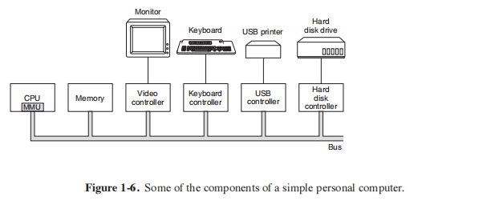

#### 1.3.1 Processors

_1.3.1 Prosesor_

The ‘‘brain’’ of the computer is the CPU. It fetches instructions from memory and executes them. The basic cycle of every CPU is to fetch the first instruction from memory, decode it to determine its type and operands, execute it, and then fetch, decode, and execute subsequent instructions. The cycle is repeated until the program finishes. In this way, programs are carried out.

_''Otak'' komputer adalah CPU. Ini mengambil instruksi dari memori dan mengeksekusinya. Siklus dasar setiap CPU adalah mengambil instruksi pertama dari memori, mendekodekannya untuk menentukan jenis dan operandnya, mengeksekusinya, dan kemudian mengambil, mendekode, dan mengeksekusi instruksi berikutnya. Siklus ini diulang sampai program selesai. Dengan cara ini, program dilakukan._

Each CPU has a specific set of instructions that it can execute. Thus an x86 processor cannot execute ARM programs and an ARM processor cannot execute x86 programs. Because accessing memory to get an instruction or data word takes much longer than executing an instruction, all CPUs contain some registers inside to hold key variables and temporary results. Thus the instruction set generally contains instructions to load a word from memory into a register, and store a word from a register into memory. Other instructions combine two operands from registers, memory, or both into a result, such as adding two words and storing the result in a register or in memory.

_Setiap CPU memiliki serangkaian instruksi khusus yang dapat dieksekusi. Jadi prosesor x86 tidak dapat menjalankan program ARM dan prosesor ARM tidak dapat menjalankan program x86. Karena mengakses memori untuk mendapatkan instruksi atau kata data membutuhkan waktu lebih lama daripada mengeksekusi instruksi, semua CPU berisi beberapa register di dalamnya untuk menyimpan variabel kunci dan hasil sementara. Jadi set instruksi umumnya berisi instruksi untuk memuat kata dari memori ke dalam register, dan menyimpan kata dari register ke dalam memori. Instruksi lain menggabungkan dua operan dari register, memori, atau keduanya menjadi hasil, seperti menambahkan dua kata dan menyimpan hasilnya dalam register atau memori._

In addition to the general registers used to hold variables and temporary results, most computers have several special registers that are visible to the programmer. One of these is the **program counter**, which contains the memory address of the next instruction to be fetched. After that instruction has been fetched, the program counter is updated to point to its successor.

_Selain register umum yang digunakan untuk menyimpan variabel dan hasil sementara, kebanyakan komputer memiliki beberapa register khusus yang dapat dilihat oleh programmer. Salah satunya adalah **program counter**, yang berisi alamat memori dari instruksi berikutnya yang akan diambil. Setelah instruksi itu diambil, penghitung program diperbarui untuk menunjuk ke penerusnya._

Another register is the **stack pointer**, which points to the top of the current stack in memory. The stack contains one frame for each procedure that has been entered but not yet exited. A procedure’s stack frame holds those input parameters, local variables, and temporary variables that are not kept in registers.

_Register lain adalah **penunjuk tumpukan**, yang menunjuk ke atas tumpukan saat ini di memori. Tumpukan berisi satu frame untuk setiap prosedur yang telah dimasukkan tetapi belum keluar. Kerangka tumpukan prosedur menyimpan parameter input, variabel lokal, dan variabel sementara yang tidak disimpan dalam register._

Yet another register is the **PSW (Program Status Word)**. This register contains the condition code bits, which are set by comparison instructions, the CPU priority, the mode (user or kernel), and various other control bits. User programs may normally read the entire PSW but typically may write only some of its fields. The PSW plays an important role in system calls and I/O.

_Namun register lain adalah **PSW (Program Status Word)**. Register ini berisi bit kode kondisi, yang diatur oleh instruksi perbandingan, prioritas CPU, mode (pengguna atau kernel), dan berbagai bit kontrol lainnya. Program pengguna biasanya dapat membaca seluruh PSW tetapi biasanya hanya dapat menulis beberapa bidangnya. PSW memainkan peran penting dalam panggilan sistem dan I/O._

The operating system must be fully aware of all the registers. When time multiplexing the CPU, the operating system will often stop the running program to (re)start another one. Every time it stops a running program, the operating system must save all the registers so they can be restored when the program runs later.

_Sistem operasi harus sepenuhnya menyadari semua register. Ketika waktu multiplexing CPU, sistem operasi akan sering menghentikan program yang sedang berjalan untuk (kembali) memulai yang lain. Setiap kali menghentikan program yang sedang berjalan, sistem operasi harus menyimpan semua register agar dapat dipulihkan ketika program berjalan nanti._

To improve performance, CPU designers have long abandoned the simple model of fetching, decoding, and executing one instruction at a time. Many modern CPUs have facilities for executing more than one instruction at the same time. For example, a CPU might have separate fetch, decode, and execute units, so that while it is executing instruction n, it could also be decoding instruction n + 1 and fetching instruction n + 2. Such an organization is called a **pipeline** and is illustrated in Fig. 1-7(a) for a pipeline with three stages. Longer pipelines are common. In most pipeline designs, once an instruction has been fetched into the pipeline, it must be executed, even if the preceding instruction was a conditional branch that was taken. Pipelines cause compiler writers and operating system writers great headaches because they expose the complexities of the underlying machine to them and they have to deal with them.

_Untuk meningkatkan kinerja, desainer CPU telah lama meninggalkan model sederhana dalam mengambil, mendekode, dan mengeksekusi satu instruksi pada satu waktu. Banyak CPU modern memiliki fasilitas untuk mengeksekusi lebih dari satu instruksi secara bersamaan. Sebagai contoh, CPU mungkin memiliki unit pengambilan, dekode, dan eksekusi terpisah, sehingga ketika sedang mengeksekusi instruksi n, CPU juga dapat mendekode instruksi n + 1 dan mengambil instruksi n + 2. Organisasi seperti itu disebut **pipeline** dan diilustrasikan pada Gambar 1-7(a) untuk pipa dengan tiga tahap. Pipa yang lebih panjang adalah hal biasa. Dalam kebanyakan desain pipa, setelah sebuah instruksi telah diambil ke dalam pipa, itu harus dieksekusi, bahkan jika instruksi sebelumnya adalah cabang bersyarat yang diambil. Pipeline menyebabkan penulis kompiler dan penulis sistem operasi sakit kepala karena mereka memaparkan kompleksitas mesin yang mendasarinya kepada mereka dan mereka harus menghadapinya._

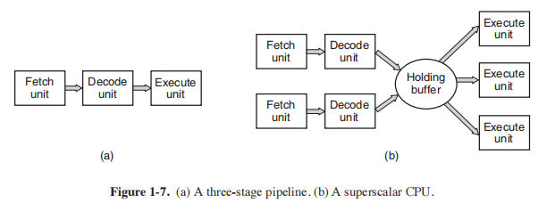

Even more advanced than a pipeline design is a **superscalar** CPU, shown in Fig. 1-7(b). In this design, multiple execution units are present, for example, one for integer arithmetic, one for floating-point arithmetic, and one for Boolean operations. Two or more instructions are fetched at once, decoded, and dumped into a holding buffer until they can be executed. As soon as an execution unit becomes available, it looks in the holding buffer to see if there is an instruction it can handle, and if so, it removes the instruction from the buffer and executes it. An implication of this design is that program instructions are often executed out of order. For the most part, it is up to the hardware to make sure the result produced is the same one a sequential implementation would have produced, but an annoying amount of the complexity is foisted onto the operating system, as we shall see.

_Bahkan lebih canggih dari desain pipa adalah CPU **superscalar**, ditunjukkan pada Gambar. 1-7(b). Dalam desain ini, beberapa unit eksekusi hadir, misalnya, satu untuk aritmatika bilangan bulat, satu untuk aritmatika titik-mengambang, dan satu untuk operasi Boolean. Dua atau lebih instruksi diambil sekaligus, didekode, dan dibuang ke buffer penahan sampai dapat dieksekusi. Segera setelah unit eksekusi tersedia, unit tersebut mencari di buffer penahan untuk melihat apakah ada instruksi yang dapat ditanganinya, dan jika demikian, unit tersebut menghapus instruksi dari buffer dan mengeksekusinya. Implikasi dari desain ini adalah bahwa instruksi program sering kali dieksekusi secara tidak berurutan. Untuk sebagian besar, tergantung pada perangkat keras untuk memastikan hasil yang dihasilkan sama dengan implementasi berurutan yang akan dihasilkan, tetapi sejumlah kerumitan yang mengganggu dimasukkan ke sistem operasi, seperti yang akan kita lihat._

Most CPUs, except very simple ones used in embedded systems, have two modes, kernel mode and user mode, as mentioned earlier. Usually, a bit in the PSW controls the mode. When running in kernel mode, the CPU can execute every instruction in its instruction set and use every feature of the hardware. On desktop and server machines, the operating system normally runs in kernel mode, giving it access to the complete hardware. On most embedded systems, a small piece runs in kernel mode, with the rest of the operating system running in user mode.

_Sebagian besar CPU, kecuali yang sangat sederhana yang digunakan dalam sistem tertanam, memiliki dua mode, mode kernel dan mode pengguna, seperti yang disebutkan sebelumnya. Biasanya, sedikit di PSW mengontrol mode. Saat berjalan dalam mode kernel, CPU dapat mengeksekusi setiap instruksi dalam set instruksinya dan menggunakan setiap fitur perangkat keras. Pada mesin desktop dan server, sistem operasi biasanya berjalan dalam mode kernel, memberikannya akses ke perangkat keras yang lengkap. Pada sebagian besar sistem tertanam, sebagian kecil berjalan dalam mode kernel, dengan sistem operasi lainnya berjalan dalam mode pengguna._

User programs always run in user mode, which permits only a subset of the instructions to be executed and a subset of the features to be accessed. Generally, all instructions involving I/O and memory protection are disallowed in user mode. Setting the PSW mode bit to enter kernel mode is also forbidden, of course.

_Program pengguna selalu berjalan dalam mode pengguna, yang memungkinkan hanya sebagian dari instruksi yang akan dieksekusi dan sebagian fitur yang akan diakses. Umumnya, semua instruksi yang melibatkan I/O dan perlindungan memori tidak diizinkan dalam mode pengguna. Mengatur bit mode PSW untuk masuk ke mode kernel juga dilarang, tentu saja._

To obtain services from the operating system, a user program must make a system call, which traps into the kernel and invokes the operating system. The TRAP instruction switches from user mode to kernel mode and starts the operating system. When the work has been completed, control is returned to the user program at the instruction following the **system call**. We will explain the details of the system call mechanism later in this chapter. For the time being, think of it as a special kind of procedure call that has the additional property of switching from user mode to kernel mode. As a note on typography, we will use the lower-case Helvetica font to indicate system calls in running text, like this: read.

_Untuk mendapatkan layanan dari sistem operasi, program pengguna harus membuat panggilan sistem, yang menjebak ke dalam kernel dan memanggil sistem operasi. Instruksi TRAP beralih dari mode pengguna ke mode kernel dan memulai sistem operasi. Ketika pekerjaan telah selesai, kontrol dikembalikan ke program pengguna pada instruksi setelah **panggilan sistem**. Kami akan menjelaskan detail mekanisme panggilan sistem nanti di bab ini. Untuk saat ini, anggap itu sebagai jenis panggilan prosedur khusus yang memiliki properti tambahan untuk beralih dari mode pengguna ke mode kernel. Sebagai catatan tentang tipografi, kami akan menggunakan font Helvetica huruf kecil untuk menunjukkan panggilan sistem dalam teks yang sedang berjalan, seperti ini: baca._

It is worth noting that computers have traps other than the instruction for executing a system call. Most of the other traps are caused by the hardware to warn of an exceptional situation such as an attempt to divide by 0 or a floating-point underflow. In all cases the operating system gets control and must decide what to do. Sometimes the program must be terminated with an error. Other times the error can be ignored (an underflowed number can be set to 0). Finally, when the program has announced in advance that it wants to handle certain kinds of conditions, control can be passed back to the program to let it deal with the problem.

_Perlu dicatat bahwa komputer memiliki jebakan selain instruksi untuk menjalankan panggilan sistem. Sebagian besar jebakan lain disebabkan oleh perangkat keras untuk memperingatkan situasi luar biasa seperti upaya membagi dengan 0 atau underflow floating-point. Dalam semua kasus, sistem operasi mendapat kendali dan harus memutuskan apa yang harus dilakukan. Terkadang program harus dihentikan dengan kesalahan. Di lain waktu kesalahan dapat diabaikan (angka yang kurang mengalir dapat diatur ke 0). Akhirnya, ketika program telah mengumumkan sebelumnya bahwa ia ingin menangani jenis kondisi tertentu, kontrol dapat diteruskan kembali ke program untuk membiarkannya menangani masalah._

##### Multithreaded and Multicore Chips

_Chip Multithread dan Multicore_

Moore’s law states that the number of transistors on a chip doubles every 18 months. This ‘‘law’’ is not some kind of law of physics, like conservation of momentum, but is an observation by Intel cofounder Gordon Moore of how fast process engineers at the semiconductor companies are able to shrink their transistors. Moore’s law has held for over three decades now and is expected to hold for at least one more. After that, the number of atoms per transistor will become too small and quantum mechanics will start to play a big role, preventing further shrinkage of transistor sizes.

_Hukum Moore menyatakan bahwa jumlah transistor pada sebuah chip berlipat ganda setiap 18 bulan. ''Hukum'' ini bukanlah semacam hukum fisika, seperti kekekalan momentum, tetapi merupakan pengamatan oleh salah satu pendiri Intel, Gordon Moore, tentang seberapa cepat insinyur proses di perusahaan semikonduktor mampu mengecilkan transistor mereka. Hukum Moore telah berlaku selama lebih dari tiga dekade sekarang dan diperkirakan akan berlaku setidaknya satu lagi. Setelah itu, jumlah atom per transistor akan menjadi terlalu kecil dan mekanika kuantum akan mulai memainkan peran besar, mencegah penyusutan lebih lanjut dari ukuran transistor._

The abundance of transistors is leading to a problem: what to do with all of them? We saw one approach above: superscalar architectures, with multiple functional units. But as the number of transistors increases, even more is possible. One obvious thing to do is put bigger caches on the CPU chip. That is definitely happening, but eventually the point of diminishing returns will be reached.

_Kelimpahan transistor menyebabkan masalah: apa yang harus dilakukan dengan semuanya? Kami melihat satu pendekatan di atas: arsitektur superscalar, dengan beberapa unit fungsional. Tetapi karena jumlah transistor meningkat, lebih banyak lagi yang mungkin. Satu hal yang jelas untuk dilakukan adalah meletakkan cache yang lebih besar pada chip CPU. Itu pasti terjadi, tetapi pada akhirnya titik hasil yang semakin berkurang akan tercapai._

The obvious next step is to replicate not only the functional units, but also some of the control logic. The Intel Pentium 4 introduced this property, called **multithreading** or **hyperthreading** (Intel’s name for it), to the x86 processor, and several other CPU chips also have it including the SPARC, the Power5, the Intel Xeon, and the Intel Core family. To a first approximation, what it does is allow the CPU to hold the state of two different threads and then switch back and forth on a nanosecond time scale. (A thread is a kind of lightweight process, which, in turn, is a running program; we will get into the details in Chap. 2.) For example, if one of the processes needs to read a word from memory (which takes many clock cycles), a multithreaded CPU can just switch to another thread. Multithreading does not offer true parallelism. Only one process at a time is running, but thread-switching time is reduced to the order of a nanosecond.

_Langkah selanjutnya yang jelas adalah mereplikasi tidak hanya unit fungsional, tetapi juga beberapa logika kontrol. Intel Pentium 4 memperkenalkan properti ini, yang disebut **multithreading** atau **hyperthreading** (nama Intel untuk itu), ke prosesor x86, dan beberapa chip CPU lainnya juga memilikinya termasuk SPARC, Power5, Intel Xeon, dan keluarga Intel Core. Untuk perkiraan pertama, apa yang dilakukannya adalah memungkinkan CPU untuk menahan status dua utas yang berbeda dan kemudian beralih bolak-balik pada skala waktu nanodetik. (Utas adalah sejenis proses ringan, yang, pada gilirannya, adalah program yang sedang berjalan; kita akan membahas detailnya di Bab 2.) Misalnya, jika salah satu proses perlu membaca kata dari memori (yang membutuhkan banyak siklus clock), CPU multithreaded hanya dapat beralih ke thread lain. Multithreading tidak menawarkan paralelisme sejati. Hanya satu proses pada satu waktu yang berjalan, tetapi waktu pemindahan utas berkurang hingga urutan nanodetik._

Multithreading has implications for the operating system because each thread appears to the operating system as a separate CPU. Consider a system with two actual CPUs, each with two threads. The operating system will see this as four CPUs. If there is only enough work to keep two CPUs busy at a certain point in time, it may inadvertently schedule two threads on the same CPU, with the other CPU completely idle. This choice is far less efficient than using one thread on each CPU.

_Multithreading memiliki implikasi untuk sistem operasi karena setiap utas muncul ke sistem operasi sebagai CPU yang terpisah. Pertimbangkan sistem dengan dua CPU yang sebenarnya, masing-masing dengan dua utas. Sistem operasi akan melihat ini sebagai empat CPU. Jika hanya ada cukup pekerjaan untuk membuat dua CPU sibuk pada titik waktu tertentu, mungkin secara tidak sengaja menjadwalkan dua utas pada CPU yang sama, dengan CPU lainnya benar-benar menganggur. Pilihan ini jauh kurang efisien daripada menggunakan satu thread pada setiap CPU._

Beyond multithreading, many CPU chips now hav e four, eight, or more complete processors or **cores** on them. The multicore chips of Fig. 1 8 effectively carry four minichips on them, each with its own independent CPU. (The caches will be explained below.) Some processors, like Intel Xeon Phi and the Tilera TilePro, already sport more than 60 cores on a single chip. Making use of such a multicore chip will definitely require a multiprocessor operating system.

_Selain multithreading, banyak chip CPU sekarang memiliki empat, delapan, atau lebih prosesor atau **inti** yang lengkap. Chip multicore pada Gambar 1 8 secara efektif membawa empat chip mini, masing-masing dengan CPU independennya sendiri. (Cache akan dijelaskan di bawah.) Beberapa prosesor, seperti Intel Xeon Phi dan Tilera TilePro, sudah memiliki lebih dari 60 core dalam satu chip. Memanfaatkan chip multicore seperti itu pasti akan membutuhkan sistem operasi multiprosesor._

Incidentally, in terms of sheer numbers, nothing beats a modern **GPU (Graphics Processing Unit)**. A GPU is a processor with, literally, thousands of tiny cores. They are very good for many small computations done in parallel, like rendering polygons in graphics applications. They are not so good at serial tasks. They are also hard to program. While GPUs can be useful for operating systems (e.g., encryption or processing of network traffic), it is not likely that much of the operating system itself will run on the GPUs.

_Kebetulan, dalam hal jumlah, tidak ada yang mengalahkan **GPU (Graphics Processing Unit)** modern. GPU adalah prosesor dengan, secara harfiah, ribuan inti kecil. Mereka sangat baik untuk banyak perhitungan kecil yang dilakukan secara paralel, seperti merender poligon dalam aplikasi grafis. Mereka tidak begitu baik dalam tugas-tugas serial. Mereka juga sulit untuk diprogram. Meskipun GPU dapat berguna untuk sistem operasi (misalnya, enkripsi atau pemrosesan lalu lintas jaringan), kemungkinan besar sistem operasi itu sendiri tidak akan berjalan di GPU._

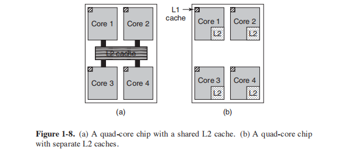

#### 1.3.2 Memory

The second major component in any computer is the memory. Ideally, a memory should be extremely fast (faster than executing an instruction so that the CPU is
not held up by the memory), abundantly large, and dirt cheap. No current technology satisfies all of these goals, so a different approach is taken. The memory system is constructed as a hierarchy of layers, as shown in Fig. 1-9. The top layers
have higher speed, smaller capacity, and greater cost per bit than the lower ones,
often by factors of a billion or more.

The top layer consists of the registers internal to the CPU. They are made of
the same material as the CPU and are thus just as fast as the CPU. Consequently,
there is no delay in accessing them. The storage capacity available in them is 

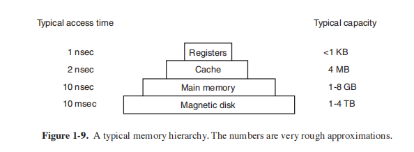

typically 32 × 32 bits on a 32-bit CPU and 64 × 64 bits on a 64-bit CPU. Less than
1 KB in both cases. Programs must manage the registers (i.e., decide what to keep
in them) themselves, in software.

Next comes the cache memory, which is mostly controlled by the hardware.
Main memory is divided up into **cache lines**, typically 64 bytes, with addresses 0
to 63 in cache line 0, 64 to 127 in cache line 1, and so on. The most heavily used
cache lines are kept in a high-speed cache located inside or very close to the CPU.
When the program needs to read a memory word, the cache hardware checks to see
if the line needed is in the cache. If it is, called a cache hit, the request is satisfied from the cache and no memory request is sent over the bus to the main memory.
**Cache hits** normally take about two clock cycles. Cache misses have to go to
memory, with a substantial time penalty. Cache memory is limited in size due to its
high cost. Some machines have two or even three levels of cache, each one slower
and bigger than the one before it.

Caching plays a major role in many areas of computer science, not just caching
lines of RAM. Whenever a resource can be divided into pieces, some of which are
used much more heavily than others, caching is often used to improve performance. Operating systems use it all the time. For example, most operating systems
keep (pieces of) heavily used files in main memory to avoid having to fetch them
from the disk repeatedly. Similarly, the results of converting long path names like

>/home/ast/projects/minix3/src/kernel/clock.c

into the disk address where the file is located can be cached to avoid repeated
lookups. Finally, when the address of a Web page (URL) is converted to a network
address (IP address), the result can be cached for future use. Many other uses exist.
In any caching system, several questions come up fairly soon, including:

1. When to put a new item into the cache.
2. Which cache line to put the new item in.
3. Which item to remove from the cache when a slot is needed.
4. Where to put a newly evicted item in the larger memory.

Not every question is relevant to every caching situation. For caching lines of main
memory in the CPU cache, a new item will generally be entered on every cache
miss. The cache line to use is generally computed by using some of the high-order
bits of the memory address referenced. For example, with 4096 cache lines of 64
bytes and 32 bit addresses, bits 6 through 17 might be used to specify the cache
line, with bits 0 to 5 the byte within the cache line. In this case, the item to remove
is the same one as the new data goes into, but in other systems it might not be.
Finally, when a cache line is rewritten to main memory (if it has been modified
since it was cached), the place in memory to rewrite it to is uniquely determined by
the address in question.

Caches are such a good idea that modern CPUs have two of them. The first
level or **L1 cache** is always inside the CPU and usually feeds decoded instructions
into the CPU’s execution engine. Most chips have a second L1 cache for very
heavily used data words. The L1 caches are typically 16 KB each. In addition,
there is often a second cache, called the **L2 cache**, that holds several megabytes of
recently used memory words. The difference between the L1 and L2 caches lies in
the timing. Access to the L1 cache is done without any delay, whereas access to
the L2 cache involves a delay of one or two clock cycles.

On multicore chips, the designers have to decide where to place the caches. In
Fig. 1-8(a), a single L2 cache is shared by all the cores. This approach is used in
Intel multicore chips. In contrast, in Fig. 1-8(b), each core has its own L2 cache.
This approach is used by AMD. Each strategy has its pros and cons. For example,
the Intel shared L2 cache requires a more complicated cache controller but the
AMD way makes keeping the L2 caches consistent more difficult.

Main memory comes next in the hierarchy of Fig. 1-9. This is the workhorse
of the memory system. Main memory is usually called **RAM (Random Access Memory)**. Old-timers sometimes call it **core memory**, because computers in the
1950s and 1960s used tiny magnetizable ferrite cores for main memory. They hav e
been gone for decades but the name persists. Currently, memories are hundreds of
megabytes to several gigabytes and growing rapidly. All CPU requests that cannot
be satisfied out of the cache go to main memory.

In addition to the main memory, many computers have a small amount of nonvolatile random-access memory. Unlike RAM, nonvolatile memory does not lose
its contents when the power is switched off. **ROM (Read Only Memory)** is programmed at the factory and cannot be changed afterward. It is fast and inexpensive. On some computers, the bootstrap loader used to start the computer is contained in ROM. Also, some I/O cards come with ROM for handling low-level device control.

**EEPROM (Electrically Erasable PROM)** and **flash memory** are also nonvolatile, but in contrast to ROM can be erased and rewritten. However, writing
them takes orders of magnitude more time than writing RAM, so they are used in
the same way ROM is, only with the additional feature that it is now possible to
correct bugs in programs they hold by rewriting them in the field.

Flash memory is also commonly used as the storage medium in portable electronic devices. It serves as film in digital cameras and as the disk in portable music
players, to name just two uses. Flash memory is intermediate in speed between
RAM and disk. Also, unlike disk memory, if it is erased too many times, it wears
out.

Yet another kind of memory is CMOS, which is volatile. Many computers use
CMOS memory to hold the current time and date. The CMOS memory and the
clock circuit that increments the time in it are powered by a small battery, so the
time is correctly updated, even when the computer is unplugged. The CMOS memory can also hold the configuration parameters, such as which disk to boot from.
CMOS is used because it draws so little power that the original factory-installed
battery often lasts for several years. However, when it begins to fail, the computer
can appear to have Alzheimer’s disease, forgetting things that it has known for
years, like which hard disk to boot from.

#### 1.3.3 Disks

Next in the hierarchy is magnetic disk (hard disk). Disk storage is two orders
of magnitude cheaper than RAM per bit and often two orders of magnitude larger
as well. The only problem is that the time to randomly access data on it is close to
three orders of magnitude slower. The reason is that a disk is a mechanical device,
as shown in Fig. 1-10.

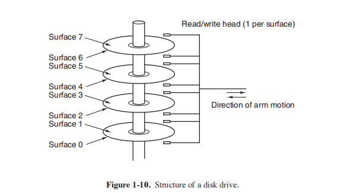

A disk consists of one or more metal platters that rotate at 5400, 7200, 10,800
RPM or more. A mechanical arm pivots over the platters from the corner, similar
to the pickup arm on an old 33-RPM phonograph for playing vinyl records. Information is written onto the disk in a series of concentric circles. At any giv en
arm position, each of the heads can read an annular region called a **track**. Together, all the tracks for a given arm position form a **cylinder**.

Each track is divided into some number of sectors, typically 512 bytes per sector. On modern disks, the outer cylinders contain more sectors than the inner ones.
Moving the arm from one cylinder to the next takes about 1 msec. Moving it to a
random cylinder typically takes 5 to 10 msec, depending on the drive. Once the
arm is on the correct track, the drive must wait for the needed sector to rotate under
the head, an additional delay of 5 msec to 10 msec, depending on the drive’s RPM.
Once the sector is under the head, reading or writing occurs at a rate of 50 MB/sec
on low-end disks to 160 MB/sec on faster ones.

Sometimes you will hear people talk about disks that are really not disks at all,
like **SSDs, (Solid State Disks)**. SSDs do not have moving parts, do not contain
platters in the shape of disks, and store data in (Flash) memory. The only ways in
which they resemble disks is that they also store a lot of data which is not lost
when the power is off.

Many computers support a scheme known as **virtual memory**, which we will
discuss at some length in Chap. 3. This scheme makes it possible to run programs
larger than physical memory by placing them on the disk and using main memory
as a kind of cache for the most heavily executed parts. This scheme requires remapping memory addresses on the fly to convert the address the program generated to the physical address in RAM where the word is located. This mapping is
done by a part of the CPU called the **MMU (Memory Management Unit)**, as
shown in Fig. 1-6.

The presence of caching and the MMU can have a major impact on performance. In a multiprogramming system, when switching from one program to
another, sometimes called a **context switch**, it may be necessary to flush all modified blocks from the cache and change the mapping registers in the MMU. Both of
these are expensive operations, and programmers try hard to avoid them. We will
see some of the implications of their tactics later.

#### 1.3.4 I/O Devices

The CPU and memory are not the only resources that the operating system
must manage. I/O devices also interact heavily with the operating system. As we
saw in Fig. 1-6, I/O devices generally consist of two parts: a controller and the device itself. The controller is a chip or a set of chips that physically controls the device. It accepts commands from the operating system, for example, to read data
from the device, and carries them out.

In many cases, the actual control of the device is complicated and detailed, so
it is the job of the controller to present a simpler (but still very complex) interface
to the operating system. For example, a disk controller might accept a command to read sector 11,206 from disk 2. The controller then has to convert this linear sector
number to a cylinder, sector, and head. This conversion may be complicated by the
fact that outer cylinders have more sectors than inner ones and that some bad sectors have been remapped onto other ones. Then the controller has to determine
which cylinder the disk arm is on and give it a command to move in or out the requisite number of cylinders. It has to wait until the proper sector has rotated under
the head and then start reading and storing the bits as they come off the drive,
removing the preamble and computing the checksum. Finally, it has to assemble
the incoming bits into words and store them in memory. To do all this work, controllers often contain small embedded computers that are programmed to do their
work.

The other piece is the actual device itself. Devices have fairly simple interfaces, both because they cannot do much and to make them standard. The latter is
needed so that any SAT A disk controller can handle any SAT A disk, for example.
**SATA** stands for **Serial ATA** and **ATA** in turn stands for **AT Attachment**. In case you are curious what AT stands for, this was IBM’s second generation ‘‘Personal
Computer Advanced Technology’’ built around the then-extremely-potent 6-MHz
80286 processor that the company introduced in 1984. What we learn from this is
that the computer industry has a habit of continuously enhancing existing acronyms with new prefixes and suffixes. We also learned that an adjective like ‘‘advanced’’ should be used with great care, or you will look silly thirty years down the
line.

SATA is currently the standard type of disk on many computers. Since the actual device interface is hidden behind the controller, all that the operating system
sees is the interface to the controller, which may be quite different from the interface to the device.

Because each type of controller is different, different software is needed to
control each one. The software that talks to a controller, giving it commands and
accepting responses, is called a **device driver**. Each controller manufacturer has to
supply a driver for each operating system it supports. Thus a scanner may come
with drivers for OS X, Windows 7, Windows 8, and Linux, for example.

To be used, the driver has to be put into the operating system so it can run in
kernel mode. Drivers can actually run outside the kernel, and operating systems
like Linux and Windows nowadays do offer some support for doing so. The vast
majority of the drivers still run below the kernel boundary. Only very few current
systems, such as MINIX 3, run all drivers in user space. Drivers in user space must
be allowed to access the device in a controlled way, which is not straightforward.

There are three ways the driver can be put into the kernel. The first way is to
relink the kernel with the new driver and then reboot the system. Many older UNIX
systems work like this. The second way is to make an entry in an operating system
file telling it that it needs the driver and then reboot the system. At boot time, the
operating system goes and finds the drivers it needs and loads them. Windows
works this way. The third way is for the operating system to be able to accept new drivers while running and install them on the fly without the need to reboot. This
way used to be rare but is becoming much more common now. Hot-pluggable
devices, such as USB and IEEE 1394 devices (discussed below), always need dynamically loaded drivers.

Every controller has a small number of registers that are used to communicate
with it. For example, a minimal disk controller might have registers for specifying
the disk address, memory address, sector count, and direction (read or write). To
activate the controller, the driver gets a command from the operating system, then
translates it into the appropriate values to write into the device registers. The collection of all the device registers forms the **I/O port space**, a subject we will come back to in Chap. 5.

On some computers, the device registers are mapped into the operating system’s address space (the addresses it can use), so they can be read and written like
ordinary memory words. On such computers, no special I/O instructions are required and user programs can be kept away from the hardware by not putting these
memory addresses within their reach (e.g., by using base and limit registers). On
other computers, the device registers are put in a special I/O port space, with each
register having a port address. On these machines, special IN and OUT instructions
are available in kernel mode to allow drivers to read and write the registers. The
former scheme eliminates the need for special I/O instructions but uses up some of
the address space. The latter uses no address space but requires special instructions. Both systems are widely used.

Input and output can be done in three different ways. In the simplest method, a
user program issues a system call, which the kernel then translates into a procedure
call to the appropriate driver. The driver then starts the I/O and sits in a tight loop
continuously polling the device to see if it is done (usually there is some bit that indicates that the device is still busy). When the I/O has completed, the driver puts
the data (if any) where they are needed and returns. The operating system then returns control to the caller. This method is called **busy waiting** and has the disadvantage of tying up the CPU polling the device until it is finished.

The second method is for the driver to start the device and ask it to give an interrupt when it is finished. At that point the driver returns. The operating system
then blocks the caller if need be and looks for other work to do. When the controller detects the end of the transfer, it generates an **interrupt** to signal completion.

Interrupts are very important in operating systems, so let us examine the idea
more closely. In Fig. 1-11(a) we see a three-step process for I/O. In step 1, the
driver tells the controller what to do by writing into its device registers. The controller then starts the device. When the controller has finished reading or writing
the number of bytes it has been told to transfer, it signals the interrupt controller
chip using certain bus lines in step 2. If the interrupt controller is ready to accept
the interrupt (which it may not be if it is busy handling a higher-priority one), it asserts a pin on the CPU chip telling it, in step 3. In step 4, the interrupt controller puts the number of the device on the bus so the CPU can read it and know which
device has just finished (many devices may be running at the same time).

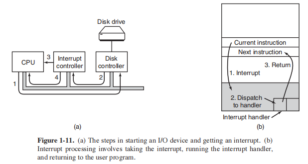

Once the CPU has decided to take the interrupt, the program counter and PSW
are typically then pushed onto the current stack and the CPU switched into kernel
mode. The device number may be used as an index into part of memory to find the
address of the interrupt handler for this device. This part of memory is called the
**interrupt vector**. Once the interrupt handler (part of the driver for the interrupting
device) has started, it removes the stacked program counter and PSW and saves
them, then queries the device to learn its status. When the handler is all finished, it
returns to the previously running user program to the first instruction that was not
yet executed. These steps are shown in Fig. 1-11(b).

The third method for doing I/O makes use of special hardware: a **DMA (Direct Memory Access)** chip that can control the flow of bits between memory
and some controller without constant CPU intervention. The CPU sets up the
DMA chip, telling it how many bytes to transfer, the device and memory addresses
involved, and the direction, and lets it go. When the DMA chip is done, it causes
an interrupt, which is handled as described above. DMA and I/O hardware in general will be discussed in more detail in Chap. 5.

Interrupts can (and often do) happen at highly inconvenient moments, for example, while another interrupt handler is running. For this reason, the CPU has a
way to disable interrupts and then reenable them later. While interrupts are disabled, any devices that finish continue to assert their interrupt signals, but the CPU
is not interrupted until interrupts are enabled again. If multiple devices finish
while interrupts are disabled, the interrupt controller decides which one to let
through first, usually based on static priorities assigned to each device. The
highest-priority device wins and gets to be serviced first. The others must wait.

The organization of Fig. 1-6 was used on minicomputers for years and also on
the original IBM PC. However, as processors and memories got faster, the ability
of a single bus (and certainly the IBM PC bus) to handle all the traffic was strained
to the breaking point. Something had to give. As a result, additional buses were
added, both for faster I/O devices and for CPU-to-memory traffic. As a consequence of this evolution, a large x86 system currently looks something like
Fig. 1-12.

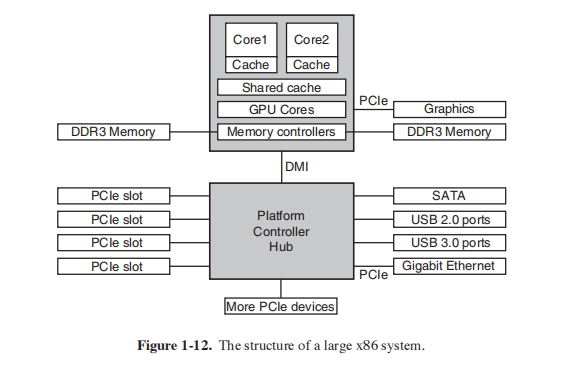

This system has many buses (e.g., cache, memory, PCIe, PCI, USB, SATA, and
DMI), each with a different transfer rate and function. The operating system must
be aware of all of them for configuration and management. The main bus is the
**PCIe (Peripheral Component Interconnect Express)** bus.

The PCIe bus was invented by Intel as a successor to the older **PCI** bus, which
in turn was a replacement for the original **ISA (Industry Standard Architecture)**
bus. Capable of transferring tens of gigabits per second, PCIe is much faster than
its predecessors. It is also very different in nature. Up to its creation in 2004, most
buses were parallel and shared. A **shared bus architecture** means that multiple devices use the same wires to transfer data. Thus, when multiple devices have data to
send, you need an arbiter to determine who can use the bus. In contrast, PCIe
makes use of dedicated, point-to-point connections. A **parallel bus architecture** as
used in traditional PCI means that you send each word of data over multiple wires.
For instance, in regular PCI buses, a single 32-bit number is sent over 32 parallel
wires. In contrast to this, PCIe uses a **serial bus architecture** and sends all bits in a message through a single connection, known as a lane, much like a network
packet. This is much simpler, because you do not have to ensure that all 32 bits
arrive at the destination at exactly the same time. Parallelism is still used, because
you can have multiple lanes in parallel. For instance, we may use 32 lanes to carry
32 messages in parallel. As the speed of peripheral devices like network cards and
graphics adapters increases rapidly, the PCIe standard is upgraded every 3–5 years.
For instance, 16 lanes of PCIe 2.0 offer 64 gigabits per second. Upgrading to PCIe
3.0 will give you twice that speed and PCIe 4.0 will double that again.

Meanwhile, we still have many leg acy devices for the older PCI standard. As
we see in Fig. 1-12, these devices are hooked up to a separate hub processor. In
the future, when we consider PCI no longer merely old, but ancient, it is possible
that all PCI devices will attach to yet another hub that in turn connects them to the
main hub, creating a tree of buses.

In this configuration, the CPU talks to memory over a fast DDR3 bus, to an external graphics device over PCIe and to all other devices via a hub over a **DMI (Direct Media Interface)** bus. The hub in turn connects all the other devices,
using the Universal Serial Bus to talk to USB devices, the SATA bus to interact
with hard disks and DVD drives, and PCIe to transfer Ethernet frames. We hav e already mentioned the older PCI devices that use a traditional PCI bus.

Moreover, each of the cores has a dedicated cache and a much larger cache that
is shared between them. Each of these caches introduces another bus.

The **USB (Universal Serial Bus)** was invented to attach all the slow I/O devices, such as the keyboard and mouse, to the computer. Howev er, calling a modern USB 3.0 device humming along at 5 Gbps ‘‘slow’’ may not come naturally for
the generation that grew up with 8-Mbps ISA as the main bus in the first IBM PCs.
USB uses a small connector with four to eleven wires (depending on the version),
some of which supply electrical power to the USB devices or connect to ground.
USB is a centralized bus in which a root device polls all the I/O devices every 1
msec to see if they hav e any traffic. USB 1.0 could handle an aggregate load of 12
Mbps, USB 2.0 increased the speed to 480 Mbps, and USB 3.0 tops at no less than
5 Gbps. Any USB device can be connected to a computer and it will function immediately, without requiring a reboot, something pre-USB devices required, much
to the consternation of a generation of frustrated users.

The **SCSI (Small Computer System Interface)** bus is a high-performance bus
intended for fast disks, scanners, and other devices needing considerable bandwidth. Nowadays, we find them mostly in servers and workstations. They can run
at up to 640 MB/sec.

To work in an environment such as that of Fig. 1-12, the operating system has
to know what peripheral devices are connected to the computer and configure
them. This requirement led Intel and Microsoft to design a PC system called plug
and play, based on a similar concept first implemented in the Apple Macintosh.
Before **plug and play**, each I/O card had a fixed interrupt request level and fixed addresses for its I/O registers. For example, the keyboard was interrupt 1 and used I/O addresses 0x60 to 0x64, the floppy disk controller was interrupt 6 and used I/O
addresses 0x3F0 to 0x3F7, and the printer was interrupt 7 and used I/O addresses
0x378 to 0x37A, and so on.

So far, so good. The trouble came in when the user bought a sound card and a
modem card and both happened to use, say, interrupt 4. They would conflict and
would not work together. The solution was to include DIP switches or jumpers on
ev ery I/O card and instruct the user to please set them to select an interrupt level
and I/O device addresses that did not conflict with any others in the user’s system.
Teenagers who devoted their lives to the intricacies of the PC hardware could
sometimes do this without making errors. Unfortunately, nobody else could, leading to chaos.

What plug and play does is have the system automatically collect information
about the I/O devices, centrally assign interrupt levels and I/O addresses, and then
tell each card what its numbers are. This work is closely related to booting the
computer, so let us look at that. It is not completely trivial.

#### 1.3.6 Booting the Computer

Very briefly, the boot process is as follows. Every PC contains a parentboard
(formerly called a motherboard before political correctness hit the computer industry). On the parentboard is a program called the system **BIOS (Basic Input Output System)**. The BIOS contains low-level I/O software, including procedures to
read the keyboard, write to the screen, and do disk I/O, among other things. Nowadays, it is held in a flash RAM, which is nonvolatile but which can be updated by
the operating system when bugs are found in the BIOS.

When the computer is booted, the BIOS is started. It first checks to see how
much RAM is installed and whether the keyboard and other basic devices are installed and responding correctly. It starts out by scanning the PCIe and PCI buses
to detect all the devices attached to them. If the devices present are different from
when the system was last booted, the new devices are configured.

The BIOS then determines the boot device by trying a list of devices stored in
the CMOS memory. The user can change this list by entering a BIOS configuration
program just after booting. Typically, an attempt is made to boot from a CD-ROM
(or sometimes USB) drive, if one is present. If that fails, the system boots from the
hard disk. The first sector from the boot device is read into memory and executed.
This sector contains a program that normally examines the partition table at the
end of the boot sector to determine which partition is active. Then a secondary boot
loader is read in from that partition. This loader reads in the operating system
from the active partition and starts it.

The operating system then queries the BIOS to get the configuration information. For each device, it checks to see if it has the device driver. If not, it asks
the user to insert a CD-ROM containing the driver (supplied by the device’s manufacturer) or to download it from the Internet. Once it has all the device drivers, the operating system loads them into the kernel. Then it initializes its tables, creates
whatever background processes are needed, and starts up a login program or GUI.

### 1.4 THE OPERATING SYSTEM ZOO

Operating systems have been around now for over half a century. During this
time, quite a variety of them have been developed, not all of them widely known.
In this section we will briefly touch upon nine of them. We will come back to
some of these different kinds of systems later in the book.

#### 1.4.1 Mainframe Operating Systems

At the high end are the operating systems for mainframes, those room-sized
computers still found in major corporate data centers. These computers differ from
personal computers in terms of their I/O capacity. A mainframe with 1000 disks
and millions of gigabytes of data is not unusual; a personal computer with these
specifications would be the envy of its friends. Mainframes are also making something of a comeback as high-end Web servers, servers for large-scale electronic
commerce sites, and servers for business-to-business transactions.

The operating systems for mainframes are heavily oriented toward processing
many jobs at once, most of which need prodigious amounts of I/O. They typically
offer three kinds of services: batch, transaction processing, and timesharing. A
batch system is one that processes routine jobs without any interactive user present.
Claims processing in an insurance company or sales reporting for a chain of stores
is typically done in batch mode. Transaction-processing systems handle large numbers of small requests, for example, check processing at a bank or airline reservations. Each unit of work is small, but the system must handle hundreds or thousands per second. Timesharing systems allow multiple remote users to run jobs on
the computer at once, such as querying a big database. These functions are closely
related; mainframe operating systems often perform all of them. An example
mainframe operating system is OS/390, a descendant of OS/360. However, mainframe operating systems are gradually being replaced by UNIX variants such as
Linux.

#### 1.4.2 Server Operating Systems

One level down are the server operating systems. They run on servers, which
are either very large personal computers, workstations, or even mainframes. They
serve multiple users at once over a network and allow the users to share hardware
and software resources. Servers can provide print service, file service, or Web service. Internet providers run many server machines to support their customers
and Websites use servers to store the Web pages and handle the incoming requests.
Typical server operating systems are Solaris, FreeBSD, Linux and Windows Server
201x.

#### 1.4.3 Multiprocessor Operating Systems

An increasingly common way to get major-league computing power is to connect multiple CPUs into a single system. Depending on precisely how they are
connected and what is shared, these systems are called parallel computers, multicomputers, or multiprocessors. They need special operating systems, but often
these are variations on the server operating systems, with special features for communication, connectivity, and consistency.

With the recent advent of multicore chips for personal computers, even
conventional desktop and notebook operating systems are starting to deal with at
least small-scale multiprocessors and the number of cores is likely to grow over
time. Luckily, quite a bit is known about multiprocessor operating systems from
years of previous research, so using this knowledge in multicore systems should
not be hard. The hard part will be having applications make use of all this computing power. Many popular operating systems, including Windows and Linux, run
on multiprocessors.

#### 1.4.4 Personal Computer Operating Systems

The next category is the personal computer operating system. Modern ones all
support multiprogramming, often with dozens of programs started up at boot time.
Their job is to provide good support to a single user. They are widely used for
word processing, spreadsheets, games, and Internet access. Common examples are
Linux, FreeBSD, Windows 7, Windows 8, and Apple’s OS X. Personal computer
operating systems are so widely known that probably little introduction is needed.
In fact, many people are not even aware that other kinds exist.

#### 1.4.5 Handheld Computer Operating Systems

Continuing on down to smaller and smaller systems, we come to tablets,
smartphones and other handheld computers. A handheld computer, originally
known as a **PDA (Personal Digital Assistant)**, is a small computer that can be
held in your hand during operation. Smartphones and tablets are the best-known
examples. As we have already seen, this market is currently dominated by
Google’s Android and Apple’s iOS, but they hav e many competitors. Most of these
devices boast multicore CPUs, GPS, cameras and other sensors, copious amounts
of memory, and sophisticated operating systems. Moreover, all of them have more
third-party applications (‘‘**apps**’’) than you can shake a (USB) stick at.

#### 1.4.6 Embedded Operating Systems

Embedded systems run on the computers that control devices that are not generally thought of as computers and which do not accept user-installed software.
Typical examples are microwave ovens, TV sets, cars, DVD recorders, traditional
phones, and MP3 players. The main property which distinguishes embedded systems from handhelds is the certainty that no untrusted software will ever run on it.
You cannot download new applications to your microwave oven—all the software
is in ROM. This means that there is no need for protection between applications,
leading to design simplification. Systems such as Embedded Linux, QNX and
VxWorks are popular in this domain.

#### 1.4.7 Sensor-Node Operating Systems

Networks of tiny sensor nodes are being deployed for numerous purposes.
These nodes are tiny computers that communicate with each other and with a base
station using wireless communication. Sensor networks are used to protect the
perimeters of buildings, guard national borders, detect fires in forests, measure
temperature and precipitation for weather forecasting, glean information about
enemy movements on battlefields, and much more.

The sensors are small battery-powered computers with built-in radios. They
have limited power and must work for long periods of time unattended outdoors,
frequently in environmentally harsh conditions. The network must be robust
enough to tolerate failures of individual nodes, which happen with ever-increasing
frequency as the batteries begin to run down.

Each sensor node is a real computer, with a CPU, RAM, ROM, and one or
more environmental sensors. It runs a small, but real operating system, usually one
that is event driven, responding to external events or making measurements periodically based on an internal clock. The operating system has to be small and simple
because the nodes have little RAM and battery lifetime is a major issue. Also, as
with embedded systems, all the programs are loaded in advance; users do not suddenly start programs they downloaded from the Internet, which makes the design
much simpler. TinyOS is a well-known operating system for a sensor node.

#### 1.4.8 Real-Time Operating Systems

Another type of operating system is the real-time system. These systems are
characterized by having time as a key parameter. For example, in industrial process-control systems, real-time computers have to collect data about the production
process and use it to control machines in the factory. Often there are hard deadlines
that must be met. For example, if a car is moving down an assembly line, certain
actions must take place at certain instants of time. If, for example, a welding robot
welds too early or too late, the car will be ruined. If the action absolutely must occur at a certain moment (or within a certain range), we have a **hard real-time system**. Many of these are found in industrial process control, avionics, military,
and similar application areas. These systems must provide absolute guarantees that
a certain action will occur by a certain time.

A **soft real-time system**, is one where missing an occasional deadline, while
not desirable, is acceptable and does not cause any permanent damage. Digital
audio or multimedia systems fall in this category. Smartphones are also soft realtime systems.

Since meeting de**adlines is crucial in (hard) real-time systems, sometimes the
operating system is simply a library linked in with the application programs, with
ev erything tightly coupled and no protection between parts of the system. An example of this type of real-time system is eCos.

The categories of handhelds, embedded systems, and real-time systems overlap
considerably. Nearly all of them have at least some soft real-time aspects. The embedded and real-time systems run only software put in by the system designers;
users cannot add their own software, which makes protection easier. The handhelds
and embedded systems are intended for consumers, whereas real-time systems are
more for industrial usage. Nevertheless, they hav e a certain amount in common.

#### 1.4.9 Smart Card Operating Systems

The smallest operating systems run on smart cards, which are credit-card-sized
devices containing a CPU chip. They hav e very severe processing power and memory constraints. Some are powered by contacts in the reader into which they are
inserted, but contactless smart cards are inductively powered, which greatly limits
what they can do. Some of them can handle only a single function, such as electronic payments, but others can handle multiple functions. Often these are proprietary systems.

Some smart cards are Java oriented. This means that the ROM on the smart
card holds an interpreter for the Java Virtual Machine (JVM). Java applets (small
programs) are downloaded to the card and are interpreted by the JVM interpreter.
Some of these cards can handle multiple Java applets at the same time, leading to
multiprogramming and the need to schedule them. Resource management and protection also become an issue when two or more applets are present at the same
time. These issues must be handled by the (usually extremely primitive) operating
system present on the card.

### 1.5 OPERATING SYSTEM CONCEPTS

Most operating systems provide certain basic concepts and abstractions such as
processes, address spaces, and files that are central to understanding them. In the
following sections, we will look at some of these basic concepts ever so briefly, as an introduction. We will come back to each of them in great detail later in this
book. To illustrate these concepts we will, from time to time, use examples, generally drawn from UNIX. Similar examples typically exist in other systems as well,
however, and we will study some of them later.

#### 1.5.1 Processes

A key concept in all operating systems is the process. A **process** is basically a
program in execution. Associated with each process is its **address space**, a list of
memory locations from 0 to some maximum, which the process can read and write.
The address space contains the executable program, the program’s data, and its
stack. Also associated with each process is a set of resources, commonly including
registers (including the program counter and stack pointer), a list of open files, outstanding alarms, lists of related processes, and all the other information needed to
run the program. A process is fundamentally a container that holds all the information needed to run a program.

We will come back to the process concept in much more detail in Chap. 2. For
the time being, the easiest way to get a good intuitive feel for a process is to think
about a multiprogramming system. The user may have started a video editing program and instructed it to convert a one-hour video to a certain format (something
that can take hours) and then gone off to surf the Web. Meanwhile, a background
process that wakes up periodically to check for incoming email may have started
running. Thus we have (at least) three active processes: the video editor, the Web
browser, and the email receiver. Periodically, the operating system decides to stop
running one process and start running another, perhaps because the first one has
used up more than its share of CPU time in the past second or two.

When a process is suspended temporarily like this, it must later be restarted in
exactly the same state it had when it was stopped. This means that all information
about the process must be explicitly saved somewhere during the suspension. For
example, the process may have sev eral files open for reading at once. Associated
with each of these files is a pointer giving the current position (i.e., the number of
the byte or record to be read next). When a process is temporarily suspended, all
these pointers must be saved so that a read call executed after the process is restarted will read the proper data. In many operating systems, all the information about each process, other than the contents of its own address space, is stored in an operating system table called the **process table**, which is an array of structures, one for each process currently in existence.

Thus, a (suspended) process consists of its address space, usually called the
**core image** (in honor of the magnetic core memories used in days of yore), and its
process table entry, which contains the contents of its registers and many other
items needed to restart the process later.

The key process-management system calls are those dealing with the creation
and termination of processes. Consider a typical example. A process called the
**command interpreter** or shell reads commands from a terminal. The user has just typed a command requesting that a program be compiled. The shell must now create a new process that will run the compiler. When that process has finished the
compilation, it executes a system call to terminate itself.

If a process can create one or more other processes (referred to as **child processes**) and these processes in turn can create child processes, we quickly arrive at the process tree structure of Fig. 1-13. Related processes that are cooperating to
get some job done often need to communicate with one another and synchronize
their activities. This communication is called **interprocess communication**, and
will be addressed in detail in Chap. 2.

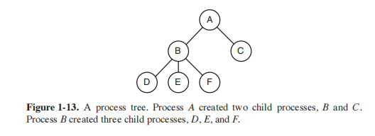

Other process system calls are available to request more memory (or release
unused memory), wait for a child process to terminate, and overlay its program
with a different one.

Occasionally, there is a need to convey information to a running process that is
not sitting around waiting for this information. For example, a process that is communicating with another process on a different computer does so by sending messages to the remote process over a computer network. To guard against the possibility that a message or its reply is lost, the sender may request that its own operating system notify it after a specified number of seconds, so that it can retransmit
the message if no acknowledgement has been received yet. After setting this timer,
the program may continue doing other work.

When the specified number of seconds has elapsed, the operating system sends
an **alarm signal** to the process. The signal causes the process to temporarily suspend whatever it was doing, save its registers on the stack, and start running a special signal-handling procedure, for example, to retransmit a presumably lost message. When the signal handler is done, the running process is restarted in the state
it was in just before the signal. Signals are the software analog of hardware interrupts and can be generated by a variety of causes in addition to timers expiring.
Many traps detected by hardware, such as executing an illegal instruction or using
an invalid address, are also converted into signals to the guilty process.

Each person authorized to use a system is assigned a **UID (User IDentification)** by the system administrator. Every process started has the UID of the person
who started it. A child process has the same UID as its parent. Users can be members of groups, each of which has a **GID (Group IDentification)**.

One UID, called the **superuser** (in UNIX), or Administrator (in Windows),
has special power and may override many of the protection rules. In large installations, only the system administrator knows the password needed to become
superuser, but many of the ordinary users (especially students) devote considerable
effort seeking flaws in the system that allow them to become superuser without the
password.

We will study processes and interprocess communication in Chap. 2.

#### 1.5.2 Address Spaces

Every computer has some main memory that it uses to hold executing programs. In a very simple operating system, only one program at a time is in memory. To run a second program, the first one has to be removed and the second one
placed in memory.

More sophisticated operating systems allow multiple programs to be in memory at the same time. To keep them from interfering with one another (and with the
operating system), some kind of protection mechanism is needed. While this mechanism has to be in the hardware, it is controlled by the operating system.

The above viewpoint is concerned with managing and protecting the computer’s main memory. A different, but equally important, memory-related issue is
managing the address space of the processes. Normally, each process has some set
of addresses it can use, typically running from 0 up to some maximum. In the simplest case, the maximum amount of address space a process has is less than the
main memory. In this way, a process can fill up its address space and there will be
enough room in main memory to hold it all.

However, on many computers addresses are 32 or 64 bits, giving an address
space of 232 or 264 bytes, respectively. What happens if a process has more address
space than the computer has main memory and the process wants to use it all? In
the first computers, such a process was just out of luck. Nowadays, a technique called virtual memory exists, as mentioned earlier, in which the operating system
keeps part of the address space in main memory and part on disk and shuttles
pieces back and forth between them as needed. In essence, the operating system
creates the abstraction of an address space as the set of addresses a process may
reference. The address space is decoupled from the machine’s physical memory
and may be either larger or smaller than the physical memory. Management of address spaces and physical memory form an important part of what an operating
system does, so all of Chap. 3 is devoted to this topic.

#### 1.5.3 Files

Another key concept supported by virtually all operating systems is the file
system. As noted before, a major function of the operating system is to hide the
peculiarities of the disks and other I/O devices and present the programmer with a nice, clean abstract model of device-independent files. System calls are obviously
needed to create files, remove files, read files, and write files. Before a file can be
read, it must be located on the disk and opened, and after being read it should be
closed, so calls are provided to do these things.

To provide a place to keep files, most PC operating systems have the concept
of a directory as a way of grouping files together. A student, for example, might
have one directory for each course he is taking (for the programs needed for that
course), another directory for his electronic mail, and still another directory for his
World Wide Web home page. System calls are then needed to create and remove
directories. Calls are also provided to put an existing file in a directory and to remove a file from a directory. Directory entries may be either files or other directories. This model also gives rise to a hierarchy—the file system—as shown in
Fig. 1-14.

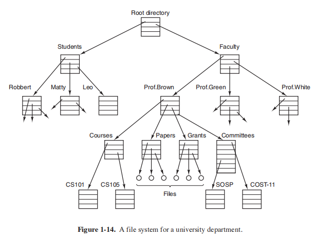

The process and file hierarchies both are organized as trees, but the similarity
stops there. Process hierarchies usually are not very deep (more than three levels is
unusual), whereas file hierarchies are commonly four, fiv e, or even more levels
deep. Process hierarchies are typically short-lived, generally minutes at most,
whereas the directory hierarchy may exist for years. Ownership and protection also
differ for processes and files. Typically, only a parent process may control or even access a child process, but mechanisms nearly always exist to allow files and directories to be read by a wider group than just the owner.

Every file within the directory hierarchy can be specified by giving its path
name from the top of the directory hierarchy, the root directory. Such absolute
path names consist of the list of directories that must be traversed from the root directory to get to the file, with slashes separating the components. In Fig. 1-14, the
path for file CS101 is /Faculty/Prof.Brown/Courses/CS101. The leading slash indicates that the path is absolute, that is, starting at the root directory. As an aside, in
Windows, the backslash (\) character is used as the separator instead of the slash (/)
character (for historical reasons), so the file path given above would be written as
\Faculty\Prof.Brown\Courses\CS101. Throughout this book we will generally use
the UNIX convention for paths.

At every instant, each process has a current working directory, in which path
names not beginning with a slash are looked for. For example, in Fig. 1-14, if
/Faculty/Prof.Brown were the working directory, use of the path Courses/CS101
would yield the same file as the absolute path name given above. Processes can
change their working directory by issuing a system call specifying the new working directory.

Before a file can be read or written, it must be opened, at which time the permissions are checked. If the access is permitted, the system returns a small integer
called a file descriptor to use in subsequent operations. If the access is prohibited,
an error code is returned.

Another important concept in UNIX is the mounted file system. Most desktop
computers have one or more optical drives into which CD-ROMs, DVDs, and Bluray discs can be inserted. They almost always have USB ports, into which USB
memory sticks (really, solid state disk drives) can be plugged, and some computers
have floppy disks or external hard disks. To provide an elegant way to deal with
these removable media UNIX allows the file system on the optical disc to be attached to the main tree. Consider the situation of Fig. 1-15(a). Before the mount
call, the root file system, on the hard disk, and a second file system, on a CDROM, are separate and unrelated.

However, the file system on the CD-ROM cannot be used, because there is no
way to specify path names on it. UNIX does not allow path names to be prefixed
by a drive name or number; that would be precisely the kind of device dependence
that operating systems ought to eliminate. Instead, the mount system call allows
the file system on the CD-ROM to be attached to the root file system wherever the
program wants it to be. In Fig. 1-15(b) the file system on the CD-ROM has been
mounted on directory b, thus allowing access to files /b/x and /b/y. If directory b
had contained any files they would not be accessible while the CD-ROM was
mounted, since /b would refer to the root directory of the CD-ROM. (Not being
able to access these files is not as serious as it at first seems: file systems are nearly always mounted on empty directories.) If a system contains multiple hard disks,
they can all be mounted into a single tree as well.
